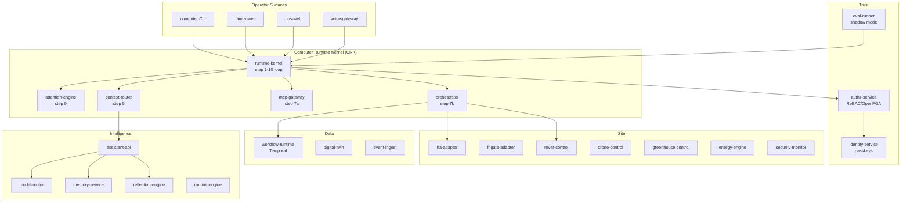

# Computer — Cyber-Physical Intelligence System

> A governed, instrumented, constraint-driven intelligence system: household assistant, site operations kernel, and founder OS in one coherent runtime.

[](https://github.com/SL1C3D-L4BS/computer/actions)
[](scripts/perfection_rubric.py)
[](LICENSE)
[](versions.json)
[](versions.json)

---

## What This Is

`Computer` is a **cyber-physical intelligence system** that unifies:

- **Household assistant** — voice, reminders, approvals, family coordination
- **Site operations kernel** — greenhouse, irrigation, energy, security, rover
- **Founder OS** — decision support, open-loop tracking, workstream awareness

It is modeled as a **constrained partially observable cyber-social control system** with typed uncertainty, explicit objectives, named invariants, and proof obligations. It is not a chatbot with plugins.

---

## System Architecture



---

## Product Surfaces

| Surface | Description | Stack |
|---------|-------------|-------|
| `apps/family-web` | Household UI — reminders, approvals, shopping, chores | Next.js, PGlite, Automerge |
| `apps/ops-web` | Operator console — policy tuning, trust report, site status | Next.js |
| `services/voice-gateway` | Voice interface — LiveKit STT/TTS, turn detection | Python, LiveKit |
| `scripts/cli/computer.py` | Operator CLI — doctor, trace, explain, drift digest | Python Click |

---

## Core Principles

| Principle | Implementation |
|-----------|----------------|
| Single entry point | All requests route through `runtime-kernel POST /execute` |
| Typed uncertainty | Every decision carries `ConfidenceScore` and `UncertaintyVector` |
| Audit everything | Every CRK step emits a structured `DecisionRationale` |
| No unconstrained self-modification | Reflection engine runs within hard invariants only |
| Safety over correctness | Invariant violations trigger conservative mode, not best-effort |
| No AI direct actuation | AI layer recommends; orchestrator dispatches; safety gates enforce |

---

## Getting Started

### Prerequisites

| Tool | Version | Install |
|------|---------|---------|
| Node.js | 24 LTS | `nvm install 24` |
| Python | 3.12 | `pyenv install 3.12.12` |
| pnpm | 9.x | `npm i -g pnpm@9` |
| Task | 3.x | `brew install go-task` |
| Docker | 27.x | [docker.com](https://docker.com) |

### Clone and bootstrap

```bash
git clone git@github.com:SL1C3D-L4BS/computer.git
cd computer
./bootstrap.sh
```

### Verify system health

```bash
task cli:doctor
python3 scripts/perfection_rubric.py
```

---

## System Bring-Up

```bash
# Start all services (development)
task dev:all

# Start core services only
task dev:core

# Start with SITL (simulation)
task sim:up
task sim:socials

# Run release-class validator
task release:validate
```

---

## Key Commands

```bash
# Operator CLI
python3 scripts/cli/computer.py doctor
python3 scripts/cli/computer.py trace <trace_id>
python3 scripts/cli/computer.py explain <trace_id>
python3 scripts/cli/computer.py drift digest --period 7d
python3 scripts/cli/computer.py trust report
python3 scripts/cli/computer.py founder brief
python3 scripts/cli/computer.py workflow list

# System validation
python3 scripts/perfection_rubric.py
task ci:full

# Scenarios
./run_scenario.sh family_dinner
./run_scenario.sh emergency_escalation
./run_scenario.sh founder_deep_work
```

---

## Repository Structure

```
computer/
├── apps/                    # User-facing applications
│   ├── assistant-api/       # AI reasoning + tool selection
│   ├── control-api/         # External HTTP entry point
│   ├── family-web/          # Household web UI (Next.js)
│   ├── model-router/        # LLM routing (Ollama/vLLM/cloud)
│   ├── ops-web/             # Operator console (Next.js)
│   ├── orchestrator/        # Site-control job engine
│   └── voice-gateway/       # LiveKit voice interface
│
├── services/                # Backend runtime services
│   ├── runtime-kernel/      # CRK — 10-step execution loop
│   ├── attention-engine/    # Interrupt/suppress/digest decisions
│   ├── authz-service/       # Authorization (RBAC → ReBAC)
│   ├── context-router/      # Intent + context routing
│   ├── eval-runner/         # Shadow mode + behavioral eval
│   ├── memory-service/      # Loop/commitment lifecycle
│   ├── reflection-engine/   # Constrained policy adaptation
│   ├── workflow-runtime/    # Temporal durable workflows
│   └── ...                  # Perception, site-control services
│
├── packages/                # Shared libraries
│   ├── runtime-contracts/   # Canonical Python types (CRK)
│   ├── mcp-gateway/         # MCP tool registry + auth
│   ├── eval-fixtures/       # Behavioral test fixtures
│   ├── policy/              # Policy definitions
│   └── ...
│
├── robotics/                # ROS2, Nav2, PX4 SITL
├── infra/                   # Ansible, Docker, k8s, OTel
├── docs/                    # Architecture, ADRs, runbooks
├── scripts/                 # CLI, rubric, release tooling
└── tests/                   # Integration, calibration, long-horizon
```

---

## Safety Model

All safety invariants are encoded in `packages/policy/` and enforced at the CRK step 4 (safety check) before any action dispatch.

| Invariant | Description |
|-----------|-------------|
| I-01 | No HIGH/CRITICAL job auto-approved without operator confirmation |
| I-02 | No cross-user memory read without explicit sharing |
| I-03 | No private content in shared-room voice output |
| I-04 | No actuation during active safety interlock |
| I-05 | All AI paths terminate at tool invocation; never at hardware write |
| I-06 | Reflection engine cannot modify safety invariants |
| I-09 | All open loops transition to ABANDONED before `max_age` |

See [`docs/architecture/kernel-authority-model.md`](docs/architecture/kernel-authority-model.md) and [`docs/safety/`](docs/safety/) for the complete model.

---

## Assistant Model

`Computer` is modeled as a **constrained partially observable cyber-social control system**:

- **State**: `SystemState` — site, household, founder context, memory, attention
- **Observations**: sensor readings, user utterances, calendar events, audit signals
- **Actions**: `ControlAction` — tool invocations, workflow triggers, voice responses
- **Objective**: minimize `AttentionCost` while maximizing `CommitmentCompletion` within safety constraints
- **Uncertainty**: every observation carries `ConfidenceScore`; decisions below 0.65 trigger clarification

See [`docs/architecture/system-state-model.md`](docs/architecture/system-state-model.md) and [`docs/architecture/objective-functions.md`](docs/architecture/objective-functions.md).

---

## Development Workflow

```bash
# Type-check all packages
pnpm typecheck

# Lint
pnpm lint

# Test (unit + integration)
task test:all

# Rubric (full system validation)
python3 scripts/perfection_rubric.py

# Calibration tests
pytest tests/calibration/ -v

# Long-horizon memory tests
pytest tests/long_horizon/ -v
```

---

## CI/CD + Gates

| Gate | Trigger | What it checks |
|------|---------|----------------|
| `web-backend.yml` | PR to main | TypeScript + Python lint, unit tests |
| `robotics.yml` | PR + weekly | ROS2 build, SITL scenarios |
| `simulation.yml` | PR + weekly | Social SITL, invariant injection |
| `security.yml` | PR to main | Semgrep static analysis |
| `release.yml` | Tag push | Release-class validator, rubric |
| `docs-gate.yml` | PR to main | README presence, markdownlint |

**Release classes** (must pass before production deploy):
- `sim-stable` → `field-qualified` → `production`

---

## Documentation Index

| Section | Location |
|---------|----------|
| Architecture docs | [`docs/architecture/`](docs/architecture/) |
| ADRs (036 total) | [`docs/adr/`](docs/adr/) |
| Product specs | [`docs/product/`](docs/product/) |
| Safety model | [`docs/safety/`](docs/safety/) |
| Runbooks | [`docs/runbooks/`](docs/runbooks/) |
| Delivery docs | [`docs/delivery/`](docs/delivery/) |
| CLI reference | [`docs/cli/command-reference.md`](docs/cli/command-reference.md) |
| Doc standards | [`docs/standards/documentation-style-guide.md`](docs/standards/documentation-style-guide.md) |
| Full index | [`docs/README.md`](docs/README.md) |

---

## V4 Operational Status

`Computer` is currently at **V4 Operational Excellence**. All 246/246 rubric checks pass.

| Domain | Status |
|--------|--------|
| CRK + invariants | Complete |
| Scientific modeling | Complete |
| CLI operator tools (21 commands) | Complete |
| MCP November 2025 spec | Complete |
| ReBAC auth evolution | Complete |
| Passkey authentication | Complete |
| Local-first family-web | Complete |
| Voice quality engineering | Complete |
| Trust KPIs + drift detection | Complete |
| Workflow production backbone | Complete |
| Field truth + shadow mode | Complete |
| Policy tuning console | Complete |

Next: **V5 — Cross-domain priority arbitration** after 30 days of V4 field stability.
