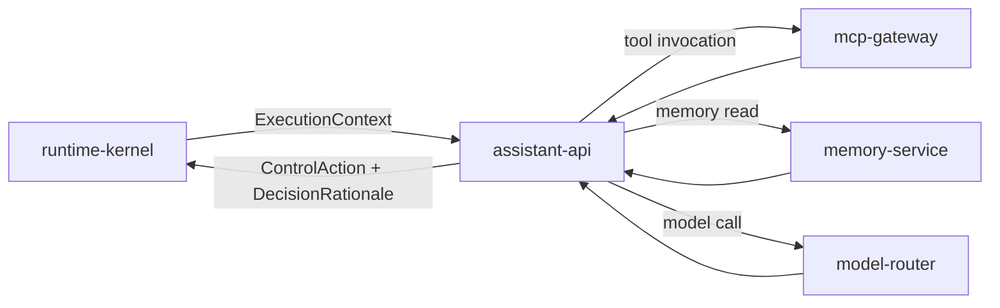

# assistant-api

> AI reasoning layer: intent classification, tool selection, response generation, and memory-aware context assembly.

---

## Overview

`assistant-api` is the **AI brain** invoked at CRK step 5–7a. It receives a structured `ExecutionContext` from `runtime-kernel`, runs intent classification, selects tools via `mcp-gateway`, assembles memory context from `memory-service`, and returns a `ControlAction` for the kernel to route.

It does not speak to users directly, does not dispatch site-control jobs, and does not modify memory.

## Responsibilities

- Receive `ExecutionContext` from `runtime-kernel`
- Classify intent and assign `RoutingDecision` (tool, workflow, direct response)
- Select and invoke MCP tools via `mcp-gateway`
- Assemble memory context (recent loops, commitments, household state)
- Return structured `ControlAction` with `DecisionRationale`
- Emit `ObservationRecord` for all decisions

**Must NOT:**
- Dispatch site-control jobs directly (routes through orchestrator via CRK step 7b)
- Modify memory state (writes go through `memory-service`)
- Call Home Assistant directly
- Make final attention decisions (step 9 belongs to `attention-engine`)

## Architecture



## Interfaces

### Inputs

| Source | Protocol | Format | Description |
|--------|----------|--------|-------------|
| `runtime-kernel` | HTTP POST | `ExecutionContext` | Full context for decision |

### Outputs

| Target | Protocol | Format | Description |
|--------|----------|--------|-------------|
| `runtime-kernel` | HTTP response | `ControlAction` + `DecisionRationale` | Decision with rationale |
| `mcp-gateway` | HTTP POST | Tool invocation request | Tool calls |
| `memory-service` | HTTP GET | Memory query | Context retrieval |

### APIs / Endpoints

```
POST /execute     — process ExecutionContext, return ControlAction
GET  /health      — liveness
```

## Contracts

- [`packages/runtime-contracts`](../../packages/runtime-contracts/) — `ExecutionContext`, `ControlAction`, `DecisionRationale`, `ConfidenceScore`
- [`packages/assistant-contracts`](../../packages/assistant-contracts/) — `RoutingDecision`, `IntentClassification`

## Dependencies

### Internal

| Service/Package | Why |
|-----------------|-----|
| `mcp-gateway` | Tool invocation |
| `memory-service` | Context retrieval |
| `model-router` | LLM inference |
| `packages/runtime-contracts` | Typed decision objects |

### External

| Library | Why |
|---------|-----|
| FastAPI | HTTP service |
| Pydantic | Schema validation |
| structlog | Structured logging |

## Configuration

| Variable | Required | Description |
|----------|----------|-------------|
| `MCP_GATEWAY_URL` | Yes | Tool fabric endpoint |
| `MEMORY_SERVICE_URL` | Yes | Memory context endpoint |
| `MODEL_ROUTER_URL` | Yes | LLM inference endpoint |
| `MIN_CONFIDENCE_THRESHOLD` | No | Below this, abstain and clarify (default: `0.65`) |

## Local Development

```bash
task dev:assistant-api
```

## Testing

```bash
task test:assistant-api
pytest apps/assistant-api/tests/ -v
```

## Observability

- **Logs**: `trace_id`, `intent_class`, `tool_selected`, `confidence`, `decision`
- **Traces**: spans for intent classification, tool invocation, memory fetch, model call

## Failure Modes

| Failure | Behavior | Recovery |
|---------|----------|----------|
| `model-router` unavailable | Returns `503` to CRK | CRK degrades to cached response |
| `mcp-gateway` unavailable | Returns `ControlAction` with `tool_unavailable` flag | Retry or degrade gracefully |
| Confidence below threshold | Returns clarification request instead of action | User provides disambiguation |

## Security / Policy

- Receives pre-authenticated `ExecutionContext`; does not re-validate caller identity
- All tool invocations flow through `mcp-gateway` with trust tier enforcement
- `DecisionRationale` required on every response; no silent decisions
