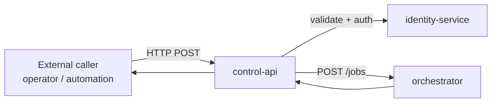

# control-api

> External HTTP entry point for all site-control job submissions; validates, authenticates, and forwards to orchestrator.

---

## Overview

`control-api` is the **only public HTTP surface for site-control operations**. It receives operator and automation requests, enforces authentication and coarse authorization, and forwards valid job submissions to `orchestrator`. It never dispatches commands directly.

See [`docs/architecture/kernel-authority-model.md`](../../docs/architecture/kernel-authority-model.md) for the authority model.

## Responsibilities

- Receive all external HTTP requests for site-control jobs
- Validate request shape against `JobRequest` schema
- Authenticate callers (JWT bearer tokens via `identity-service`)
- Forward valid requests to `orchestrator POST /jobs`
- Return job IDs and status to callers
- Rate-limit and throttle external callers

**Must NOT:**
- Evaluate job policy (that is `orchestrator`'s responsibility)
- Dispatch commands to MQTT
- Access `digital-twin` directly

## Architecture



## Interfaces

### Inputs

| Source | Protocol | Format | Description |
|--------|----------|--------|-------------|
| Operators / automations | HTTP POST | JSON `JobRequest` | Site-control job submission |

### Outputs

| Target | Protocol | Format | Description |
|--------|----------|--------|-------------|
| `orchestrator` | HTTP POST | JSON `JobRequest` | Forwarded job submission |

### APIs / Endpoints

```
POST /api/v1/jobs         — submit site-control job
GET  /api/v1/jobs/:id     — poll job status
GET  /health              — liveness
```

## Contracts

- [`packages/contracts`](../../packages/contracts/) — `JobRequest`, `JobStatus`

## Dependencies

### Internal

| Service/Package | Why |
|-----------------|-----|
| `identity-service` | JWT validation |
| `orchestrator` | Job execution |
| `packages/contracts` | Shared schemas |

### External

| Library | Why |
|---------|-----|
| FastAPI | HTTP framework |
| httpx | Async HTTP client for orchestrator calls |
| structlog | Structured logging |

## Configuration

| Variable | Required | Description |
|----------|----------|-------------|
| `ORCHESTRATOR_URL` | Yes | Internal URL for orchestrator service |
| `IDENTITY_SERVICE_URL` | Yes | JWT validation endpoint |
| `RATE_LIMIT_RPM` | No | Requests per minute per caller (default: `60`) |

## Local Development

```bash
task dev:control-api
```

## Testing

```bash
task test:control-api
```

## Observability

- **Logs**: request method, path, caller identity, job_id, upstream response code
- **Traces**: spans for auth validation and orchestrator forwarding

## Failure Modes

| Failure | Behavior | Recovery |
|---------|----------|----------|
| `identity-service` down | Returns `503` | Retry with backoff |
| `orchestrator` down | Returns `503` | Retry with backoff |
| Invalid JWT | Returns `401` | Caller fixes token |
| Schema validation failure | Returns `422` | Caller fixes request |

## Security / Policy

- All requests require valid JWT bearer token
- Token claims validated against `identity-service`
- No unauthenticated endpoints except `/health`
