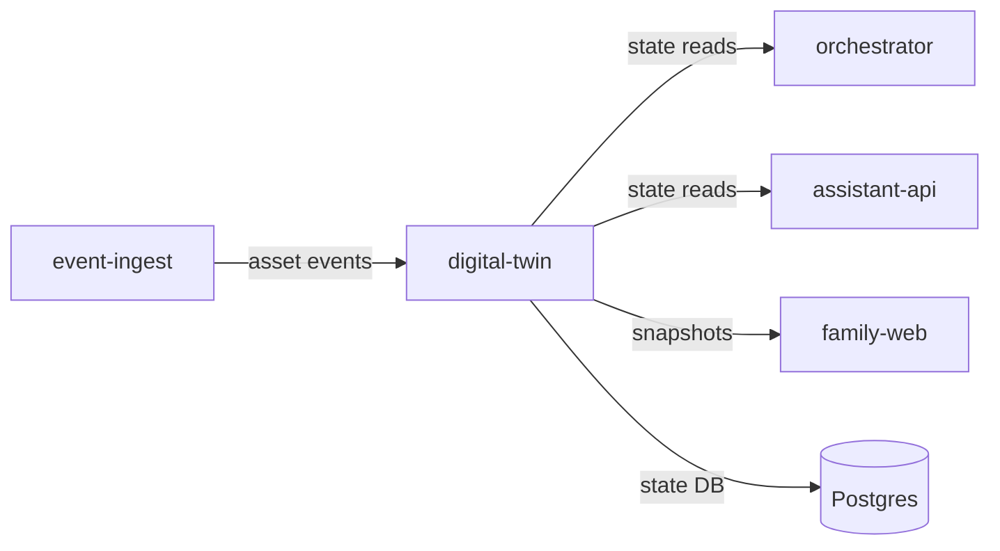

# digital-twin

> Authoritative read model for all site asset state: sensors, devices, actuators, and environment.

---

## Overview

`digital-twin` owns the **canonical current state of all physical site assets**. It ingests sensor readings, actuator acknowledgments, and Home Assistant events via `event-ingest`, maintains a consistent asset state model, and provides read access to all other services. It does not dispatch commands.

## Responsibilities

- Maintain authoritative state for all registered site assets
- Ingest asset events from `event-ingest`
- Provide read API for current asset state (snapshot and streaming)
- Track asset health and last-seen timestamps
- Emit state-change events to subscribers

**Must NOT:**
- Accept command dispatch requests
- Perform policy evaluation
- Write to `orchestrator` directly

## Architecture



## Interfaces

### Inputs

| Source | Protocol | Format | Description |
|--------|----------|--------|-------------|
| `event-ingest` | HTTP POST | `AssetEvent` | Sensor/actuator state changes |

### Outputs

| Target | Protocol | Format | Description |
|--------|----------|--------|-------------|
| Consumers | HTTP GET | `AssetSnapshot` | Current asset state |

### APIs / Endpoints

```
GET  /assets                — list all registered assets
GET  /assets/:id            — current state for asset
GET  /assets/:id/history    — state history (time-bounded)
POST /assets/:id/ingest     — ingest state update (internal only)
GET  /health                — liveness
```

## Configuration

| Variable | Required | Description |
|----------|----------|-------------|
| `DATABASE_URL` | Yes | Postgres connection string |
| `EVENT_RETENTION_DAYS` | No | State history retention (default: `90`) |

## Local Development

```bash
task dev:digital-twin
```

## Testing

```bash
task test:digital-twin
```

## Observability

- **Logs**: `asset_id`, `event_type`, `old_state`, `new_state`, `source`
- **Metrics**: events/sec ingested, asset staleness distribution

## Failure Modes

| Failure | Behavior | Recovery |
|---------|----------|----------|
| `event-ingest` unavailable | State goes stale; returns last-known with `stale: true` | Resumes on reconnect |
| Postgres unavailable | Returns `503` | Restart when DB recovers |
