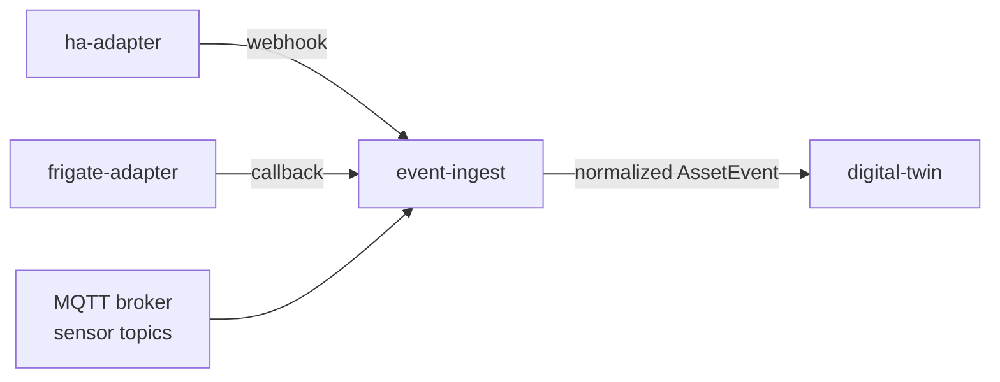

# event-ingest

> Event ingestion gateway: normalizes and routes raw events from Home Assistant, Frigate, MQTT, and sensors into the site asset model.

---

## Overview

`event-ingest` is the **boundary between the physical world and the software model**. It receives raw events from all site data sources, normalizes them into canonical `AssetEvent` format, applies basic validation and deduplication, and forwards them to `digital-twin` for state maintenance.

## Responsibilities

- Receive events from HA webhooks, Frigate callbacks, MQTT sensor topics, and direct sensor integrations
- Normalize event formats into canonical `AssetEvent`
- Deduplicate high-frequency sensor events (configurable window)
- Forward normalized events to `digital-twin`
- Log all received and rejected events

**Must NOT:**
- Perform policy evaluation
- Write to `orchestrator`
- Store events long-term (that is `digital-twin`)

## Architecture



## Interfaces

### Inputs

| Source | Protocol | Format | Description |
|--------|----------|--------|-------------|
| `ha-adapter` | HTTP POST | HA event JSON | Home Assistant state changes |
| `frigate-adapter` | HTTP POST | Frigate event JSON | Camera/detection events |
| MQTT | Subscribe | sensor topic JSON | Direct sensor readings |

### APIs / Endpoints

```
POST /ingest/ha        — Home Assistant event webhook
POST /ingest/frigate   — Frigate detection event
POST /ingest/sensor    — Direct sensor push
GET  /health           — liveness
```

## Configuration

| Variable | Required | Description |
|----------|----------|-------------|
| `DIGITAL_TWIN_URL` | Yes | Forward target |
| `MQTT_BROKER_URL` | Yes | MQTT sensor topic subscription |
| `DEDUP_WINDOW_MS` | No | Deduplication window (default: `1000`) |

## Local Development

```bash
task dev:event-ingest
```

## Testing

```bash
task test:event-ingest
```

## Failure Modes

| Failure | Behavior | Recovery |
|---------|----------|----------|
| `digital-twin` unavailable | Events buffered in memory (up to 10k); drop oldest on overflow | Forward on reconnect |
| Malformed event | Logged and discarded; counter incremented | Review source adapter |
