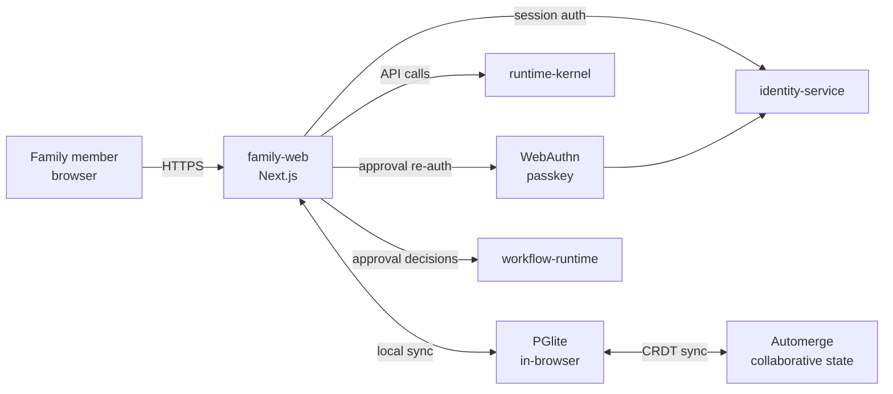

# family-web

> Household web UI: reminders, approvals, shopping, chores, and offline-resilient household state for all family members.

---

## Overview

`family-web` is the **household-facing product surface** of Computer. It provides a mobile-friendly UI for managing shared household state — reminders, approval queues, shopping lists, chore assignments — with offline resilience via PGlite local persistence and Automerge CRDT sync.

Authentication uses **passkeys (WebAuthn)** with a two-track model: session auth for browsing, approval-grade passkey re-auth for sensitive actions.

See [`docs/architecture/local-first-sync-strategy.md`](../../docs/architecture/local-first-sync-strategy.md) and [`docs/architecture/passkey-auth-strategy.md`](../../docs/architecture/passkey-auth-strategy.md).

## Responsibilities

- Household dashboard: status, pending approvals, open reminders
- Shopping list management (local-first, offline-capable)
- Chore assignment view (local-first, offline-capable)
- Approval queue: family member approves/rejects pending `ApprovalWorkflow` items
- Passkey registration and login (`/auth/register`, `/auth/login`)
- Offline-aware data access with stale-while-revalidate pattern

**Must NOT:**
- Access site-control state directly (reads from `runtime-kernel` snapshots only)
- Store work memory or personal memory cross-device without explicit device-trust story
- Expose operator controls (those are in `ops-web`)

## Architecture



## Interfaces

### Inputs

| Source | Protocol | Format | Description |
|--------|----------|--------|-------------|
| Browser | HTTPS | User actions | Household management |
| `runtime-kernel` | HTTP GET | JSON snapshots | Dashboard data |

### Outputs

| Target | Protocol | Format | Description |
|--------|----------|--------|-------------|
| `runtime-kernel` | HTTP POST | `ApprovalDecision` | Approval responses |
| `identity-service` | HTTP POST | WebAuthn ceremony | Auth flows |

### APIs / Endpoints

```
/                          — household dashboard
/approvals                 — pending approval queue
/shopping                  — shopping list (offline-capable)
/chores                    — chore assignments (offline-capable)
/auth/register             — passkey registration
/auth/login                — passkey login
/policy-tuning             — (ops-web embedded; requires T2 auth)
```

## Contracts

- [`packages/sync-model`](../../packages/sync-model/) — `ShoppingListDoc`, `ChoreAssignmentsDoc`, `SyncState`
- [`packages/runtime-contracts`](../../packages/runtime-contracts/) — `ApprovalWorkflow` input/output types

## Local-First Scope

> **NOTE:** Local-first sync applies only to scoped household data. See ADR-035.

| Data type | Local-first | Offline-capable |
|-----------|-------------|-----------------|
| Shopping lists | Yes (Automerge) | Full offline |
| Chore assignments | Yes (Automerge) | Full offline |
| Reminder history | Yes (PGlite cache) | Read-only offline |
| Approval queue | Yes (PGlite cache) | Read-only offline |
| Work memory | No | Network required |
| Site-control state | No | Network required |

## Dependencies

### Internal

| Service/Package | Why |
|-----------------|-----|
| `runtime-kernel` | Dashboard data, approval submission |
| `identity-service` | Auth ceremonies |
| `workflow-runtime` | Approval workflow integration |
| `packages/sync-model` | CRDT type definitions |

### External

| Library | Why |
|---------|-----|
| Next.js 15 | App framework |
| PGlite | In-browser Postgres persistence |
| Automerge | CRDT collaborative state |
| `@simplewebauthn/browser` | WebAuthn client |

## Configuration

| Variable | Required | Description |
|----------|----------|-------------|
| `NEXT_PUBLIC_API_URL` | Yes | `runtime-kernel` base URL |
| `NEXT_PUBLIC_IDENTITY_URL` | Yes | `identity-service` base URL |
| `NEXT_PUBLIC_PASSKEY_RP_ID` | Yes | WebAuthn relying party ID |

## Local Development

```bash
task dev:family-web
```

## Testing

```bash
task test:family-web
```

## Observability

- Client-side errors reported via structured console output
- Network requests traced with `trace_id` header from `runtime-kernel`

## Failure Modes

| Failure | Behavior | Recovery |
|---------|----------|----------|
| Network unavailable | Local-first data served from PGlite cache | Sync resumes on reconnect |
| `runtime-kernel` unreachable | Approvals queued locally; submitted on reconnect | Auto-sync |
| WebAuthn not supported | Falls back to session-only (no approval-grade actions) | User notified |

## Security / Policy

- Session track: standard JWT from `identity-service`
- Approval track: passkey re-auth required for all sensitive actions (memory export, approval submission, policy changes)
- No work memory or private data stored in browser without explicit user consent
- See [ADR-034](../../docs/adr/ADR-034-passkey-first-auth-family-web.md) and [ADR-035](../../docs/adr/ADR-035-local-first-sync-scope.md)
