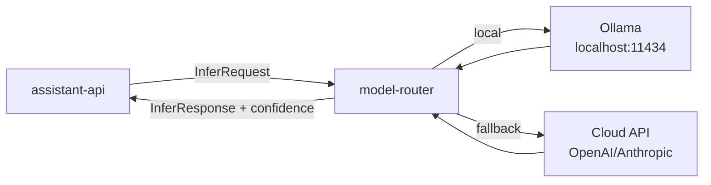

# model-router

> LLM routing layer: selects the appropriate model backend (Ollama / cloud) based on mode, task complexity, and latency budget.

---

## Overview

`model-router` abstracts all LLM inference behind a single `/infer` endpoint. It selects the backend — local Ollama, vLLM, or cloud fallback — based on the current `SystemMode`, task `ComplexityScore`, and configured latency budget. It ensures no direct model calls exist in application code.

## Responsibilities

- Route inference requests to the appropriate backend
- Enforce per-mode latency budgets (PERSONAL: ≤800ms, EMERGENCY: ≤400ms)
- Apply prompt templates from `packages/prompts`
- Return structured completions with `ConfidenceScore`
- Log all model calls with backend selected, latency, and token counts

**Must NOT:**
- Make policy decisions (that is `assistant-api`)
- Access memory or context directly
- Modify prompt templates at runtime

## Architecture



## Interfaces

### Inputs

| Source | Protocol | Format | Description |
|--------|----------|--------|-------------|
| `assistant-api` | HTTP POST | `InferRequest` | Inference request with prompt, mode, budget |

### Outputs

| Target | Protocol | Format | Description |
|--------|----------|--------|-------------|
| `assistant-api` | HTTP response | `InferResponse` | Completion + confidence + backend used |

### APIs / Endpoints

```
POST /infer       — route inference request to appropriate backend
GET  /backends    — list available backends and their health
GET  /health      — liveness
```

## Contracts

- [`packages/runtime-contracts`](../../packages/runtime-contracts/) — `ConfidenceScore`
- [`packages/prompts`](../../packages/prompts/) — prompt templates per mode/task

## Configuration

| Variable | Required | Description |
|----------|----------|-------------|
| `OLLAMA_URL` | Yes | Local Ollama endpoint |
| `CLOUD_API_KEY` | No | Cloud model API key (for fallback) |
| `PREFER_LOCAL` | No | Always use local if available (default: `true`) |
| `LATENCY_BUDGET_MS` | No | Per-mode latency budgets as JSON map |

## Local Development

```bash
task dev:model-router
```

## Testing

```bash
task test:model-router
```

## Observability

- **Logs**: `backend_selected`, `model_name`, `latency_ms`, `tokens_in`, `tokens_out`, `confidence`
- **Metrics**: per-backend latency histogram, token throughput, fallback rate

## Failure Modes

| Failure | Behavior | Recovery |
|---------|----------|----------|
| Ollama unavailable | Falls back to cloud backend if configured | Alert on sustained Ollama failure |
| All backends unavailable | Returns `503` | System degrades to cached/scripted responses |
| Latency budget exceeded | Returns partial result with `confidence: 0` | Caller handles degraded response |

## Security / Policy

- Cloud API key stored in secrets manager; never in environment files committed to repo
- No user PII in prompt logs; prompts are sanitized before logging
