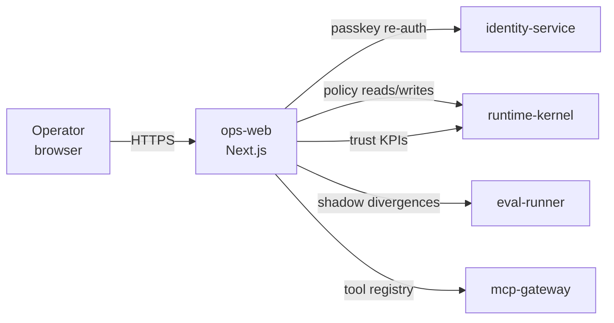

# ops-web

> Operator console: policy tuning, trust report, shadow review, tool audit, and system health for operators and founders.

---

## Overview

`ops-web` is the **operator-facing product surface** of Computer. It provides the policy tuning console, trust KPI dashboard, shadow mode review, drift digest, and tool lifecycle management. All sensitive actions require passkey re-auth (approval track).

See [`docs/product/policy-tuning-console.md`](../../docs/product/policy-tuning-console.md) and [`docs/delivery/policy-publish-gate.md`](../../docs/delivery/policy-publish-gate.md).

## Responsibilities

- Policy tuning console: parameter table, impact report filing, replay viewer, change history
- Trust KPI dashboard: 11 KPIs with threshold alerts
- Shadow mode review: live vs shadow policy divergence log
- Tool audit: verify all registered MCP tools meet admission criteria
- Drift digest: weekly drift event summary
- Founder brief and decision load index

**Must NOT:**
- Allow policy publish without `PolicyImpactReport` + replay + passkey re-auth
- Expose raw site-control actuator controls (those are in `control-api`)
- Allow parameter changes to bypass the three hard gates

## Architecture



## Interfaces

### APIs / Endpoints

```
/                          — operator dashboard
/policy-tuning             — parameter table + impact report form
/policy-tuning/simulate    — replay viewer (publish blocked until complete)
/policy-tuning/history     — policy change audit log
/trust                     — trust KPI dashboard
/shadow                    — shadow mode divergence review
/tools                     — tool registry audit
/drift                     — weekly drift digest
```

## Policy Publish Gates

> **INVARIANT:** No policy change may be published without all three gates passing.

1. `PolicyImpactReport` filed before replay begins
2. Replay against ≥N traces with divergence rate within threshold
3. Passkey re-auth at time of publish

See [`docs/delivery/policy-publish-gate.md`](../../docs/delivery/policy-publish-gate.md) and [ADR-036](../../docs/adr/ADR-036-policy-tuning-requires-impact-report-and-replay.md).

## Dependencies

### Internal

| Service/Package | Why |
|-----------------|-----|
| `runtime-kernel` | Policy reads/writes, KPI data |
| `eval-runner` | Shadow divergence log |
| `mcp-gateway` | Tool registry |
| `identity-service` | Passkey re-auth |

### External

| Library | Why |
|---------|-----|
| Next.js 15 | App framework |
| `@simplewebauthn/browser` | WebAuthn client |

## Configuration

| Variable | Required | Description |
|----------|----------|-------------|
| `NEXT_PUBLIC_API_URL` | Yes | `runtime-kernel` base URL |
| `NEXT_PUBLIC_EVAL_URL` | Yes | `eval-runner` base URL |
| `NEXT_PUBLIC_IDENTITY_URL` | Yes | `identity-service` base URL |

## Local Development

```bash
task dev:ops-web
```

## Testing

```bash
task test:ops-web
```

## Failure Modes

| Failure | Behavior | Recovery |
|---------|----------|----------|
| Passkey re-auth fails | Publish blocked; user must retry | Re-attempt WebAuthn ceremony |
| Replay service unavailable | Publish blocked; user notified | Retry when eval-runner recovers |
| Divergence rate too high | Publish blocked with explanation | Revise parameter or file new impact report |

## Security / Policy

- Approval track required for all write operations
- Passkey re-auth required at publish time, not just login
- All policy changes emitted to audit log with operator identity, timestamp, and impact report ID
