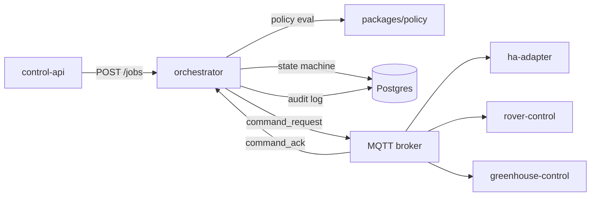

# orchestrator

> Site-control job engine: policy evaluation, state machine, command dispatch, and canonical audit record for all site-domain actions.

---

## Overview

The orchestrator is the **canonical authority for site-control job semantics**. It accepts job submissions from `control-api`, evaluates policy, advances the job state machine, and dispatches commands to site-control services via MQTT.

It is explicitly NOT the CRK (Computer Runtime Kernel). The CRK owns request lifecycle; the orchestrator owns canonical site-control job semantics.

See [`docs/architecture/kernel-authority-model.md`](../../docs/architecture/kernel-authority-model.md).

## Responsibilities

- Accept job submissions from `control-api` only (never from external callers directly)
- Evaluate policy: `risk_class × origin → approval_mode`
- Advance the job state machine: `PENDING → VALIDATING → APPROVED → EXECUTING → COMPLETED | FAILED | ABORTED`
- Log all state transitions and command dispatches to Postgres
- Dispatch commands to control services via MQTT `command_request` topics
- Receive `command_ack` and advance job state
- Enforce Invariant I-01: no `HIGH`/`CRITICAL` job with `AUTO` approval

**Must NOT:**
- Accept public HTTP requests (those route through `control-api`)
- Publish to actuator topics from AI paths
- Call Home Assistant directly
- Mutate asset state in `digital-twin` (reads only; `digital-twin` owns writes)

## Architecture



## Interfaces

### Inputs

| Source | Protocol | Format | Description |
|--------|----------|--------|-------------|
| `control-api` | HTTP POST | JSON `JobRequest` | Job submission |
| MQTT | `command_ack` topic | JSON | Command acknowledgment from control services |

### Outputs

| Target | Protocol | Format | Description |
|--------|----------|--------|-------------|
| MQTT broker | Publish | JSON `CommandRequest` | Dispatch to site-control services |
| Postgres | Write | SQL | Job state + audit log |

### APIs / Endpoints

```
POST /jobs              — submit a new site-control job
GET  /jobs/:id          — get job status
GET  /jobs/:id/audit    — get full audit trail for job
POST /jobs/:id/approve  — operator approval for MANUAL_APPROVAL jobs
POST /jobs/:id/abort    — abort in-progress job
GET  /health            — liveness check
```

## Contracts

- [`packages/contracts`](../../packages/contracts/) — `JobRequest`, `JobState`, `CommandRequest`, `CommandAck`
- [`packages/policy`](../../packages/policy/) — `RiskClass`, `ApprovalMode`, `PolicyResult`

## Dependencies

### Internal

| Service/Package | Why |
|-----------------|-----|
| `packages/policy` | Policy evaluation |
| `packages/contracts` | Shared type definitions |
| `packages/runtime-contracts` | `ControlAction`, `InvariantCheckResult` |

### External

| Library | Why |
|---------|-----|
| FastAPI | HTTP service |
| SQLAlchemy | Postgres ORM |
| asyncpg | Async Postgres driver |
| aiomqtt | MQTT client |
| structlog | Structured logging |

## Configuration

| Variable | Required | Description |
|----------|----------|-------------|
| `DATABASE_URL` | Yes | Postgres connection string |
| `MQTT_BROKER_URL` | Yes | MQTT broker address |
| `POLICY_STRICT_MODE` | No | Enforce policy rejections (default: `true`) |

## Local Development

```bash
task dev:orchestrator
```

## Testing

```bash
task test:orchestrator
pytest services/orchestrator/tests/ -v
```

## Observability

- **Logs**: structured JSON; key fields: `job_id`, `state`, `risk_class`, `approval_mode`, `trace_id`
- **Metrics**: job throughput, approval latency, abort rate at `:9090/metrics`
- **Traces**: OpenTelemetry spans for each state transition

## Failure Modes

| Failure | Behavior | Recovery |
|---------|----------|----------|
| MQTT broker unreachable | Job stays in `EXECUTING`; retries with backoff | Auto-recover on reconnect |
| Postgres unavailable | Returns `503`; no state mutation | Restart when DB recovers |
| Policy evaluation error | Job transitions to `FAILED`; no dispatch | Review policy config |
| Command timeout (no ack) | Job transitions to `FAILED` after configurable TTL | Operator review |

## Security / Policy

- Auth: `control-api` presents operator JWT; orchestrator validates before accepting jobs
- Policy enforcement: `packages/policy` evaluates `risk_class × origin` before any dispatch
- Invariant I-01: `HIGH`/`CRITICAL` jobs with `AUTO` approval mode are rejected unconditionally

## Roadmap / Notes

- Migration to ReBAC (OpenFGA) for fine-grained job authorization: see ADR-033
