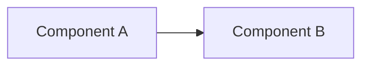

# Documentation Style Guide

> Canonical standard for all documentation in the `computer` monorepo. Every README, architecture doc, ADR, and runbook must comply.

---

## Tone

- **Technical, precise, no marketing.** State what a thing does; do not sell it.
- Write for an engineer reading under incident pressure, not a product demo audience.
- Prefer declarative statements over imperative instructions in prose.
- No fluff phrases: "powerful," "seamlessly," "cutting-edge," "leverage," "synergy."

---

## Heading Hierarchy

```
# Title (one per document)
## Section
### Subsection
#### Detail (use sparingly)
```

- Every document starts with `#` title then `>` one-line summary blockquote.
- `##` sections are the primary navigation unit — keep them scannable.
- Never skip levels (e.g., `#` → `###` without `##`).

---

## Emoji Usage

**Minimal and structural only.**

Allowed in section headings to aid scanning:

| Symbol | Use |
|--------|-----|
| `>` | Summary blockquotes only (not emoji) |
| None by default | Default for most headings |

Do NOT use emoji as decoration, filler, or enthusiasm markers. No ✨, 🚀, 💪.

---

## Code Blocks

Always language-tagged:

````markdown
```python
def example() -> None:
    pass
```
````

Supported tags: `python`, `typescript`, `bash`, `yaml`, `json`, `mermaid`, `fga`, `sql`, `toml`.

Inline code uses single backticks: `variable_name`, `ServiceName`, `POST /endpoint`.

---

## Diagrams

**Mermaid only.** No PNG exports, no external diagram tools, no draw.io XML.

````markdown

````

Every core service README must include at least one architecture diagram. Diagram must show:
- Primary inputs and outputs
- Key internal components
- Integration points with other services

---

## Section Ordering (non-negotiable)

For service/package READMEs, sections appear in this exact order:

1. Title + one-line summary
2. Overview
3. Responsibilities
4. Architecture (diagram required for services)
5. Interfaces (Inputs / Outputs / APIs)
6. Contracts
7. Dependencies
8. Configuration
9. Local Development
10. Testing
11. Observability
12. Failure Modes
13. Security / Policy
14. Roadmap / Notes (optional)

For ADRs, use the standard ADR format: Status / Context / Decision / Consequences.

For architecture docs, use: Overview / Model / Constraints / Implementation Notes.

---

## Table Formatting

Always use pipe-aligned markdown tables with a header separator:

```markdown
| Column A | Column B | Column C |
|----------|----------|----------|
| value    | value    | value    |
```

No raw HTML tables.

---

## Badge Usage Rules (root README only)

Badges appear immediately after the title and one-liner, before `---`:

- CI status
- Rubric pass rate
- License
- Node/Python version pins

Do not add badges to service or package READMEs.

---

## Callout Blocks

Use blockquotes for callouts:

```markdown
> **NOTE:** Something worth noting but not critical.

> **WARNING:** Will cause failure if ignored.

> **INVARIANT:** A system-level constraint that must never be violated.
```

---

## Internal Links

Link to canonical docs instead of repeating content:

```markdown
See [kernel-authority-model.md](../../docs/architecture/kernel-authority-model.md).
```

Relative paths from the file's location. Do not use absolute repo paths.

---

## Length Limits

| Document type | Max lines |
|---------------|-----------|
| Service README | 500 |
| Package README | 300 |
| Architecture doc | 400 |
| ADR | 150 |
| Runbook | 300 |

---

## Content Duplication Rule

**Never duplicate system-wide explanations.** If content belongs in a canonical doc, link to it. Duplication creates drift.

Examples of what must NOT be repeated per-service:
- What MCP is
- What the CRK is
- What Temporal is
- The safety model
- The auth model

---

## Docs Ownership

Every doc must be maintainable. If it requires constant updates to stay current with code, it is in the wrong form — convert it to generated output or remove it.
