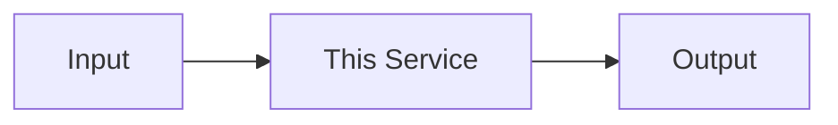

# <SERVICE / PACKAGE NAME>

> One-line description: what it does, not what it is for.

---

## Overview

- What problem this solves
- Where it sits in the Computer architecture
- Which runtime plane it belongs to (CRK / Perception / Control / Assistant / Operator)

## Responsibilities

- Bullet list of hard responsibilities only (what this service owns)
- What this service must NOT do (hard boundaries)

## Architecture



_Replace with actual component diagram showing primary data flow and integration points._

## Interfaces

### Inputs

| Source | Protocol | Format | Description |
|--------|----------|--------|-------------|
| service-name | HTTP POST | JSON | Description |

### Outputs

| Target | Protocol | Format | Description |
|--------|----------|--------|-------------|
| service-name | MQTT | JSON | Description |

### APIs / Endpoints

```
POST /endpoint    — description
GET  /endpoint    — description
```

## Contracts

- [`packages/runtime-contracts`](../../packages/runtime-contracts/) — key types used
- Link to relevant schema files

## Dependencies

### Internal

| Service/Package | Why |
|-----------------|-----|
| `service-name` | reason |

### External

| Library | Version | Why |
|---------|---------|-----|
| `library` | `x.y.z` | reason |

## Configuration

| Variable | Default | Required | Description |
|----------|---------|----------|-------------|
| `VAR_NAME` | `value` | Yes | Description |

## Local Development

```bash
task dev:<service-name>
```

## Testing

```bash
task test:<service-name>
```

## Observability

- **Logs**: structured JSON via `structlog`; key event fields: `trace_id`, `step`, `decision`
- **Metrics**: Prometheus endpoint at `:9090/metrics`
- **Traces**: OpenTelemetry spans sent to OTEL collector

## Failure Modes

| Failure | Behavior | Recovery |
|---------|----------|----------|
| Downstream unavailable | Returns `503` with retry hint | Automatic retry with backoff |
| Invalid input | Returns `422` with validation detail | Caller fixes request |

## Security / Policy

- Auth model: describe trust tier and required claims
- Policy enforcement: link to relevant policy doc

## Roadmap / Notes

- Actionable only — no history, no aspirations without owners
