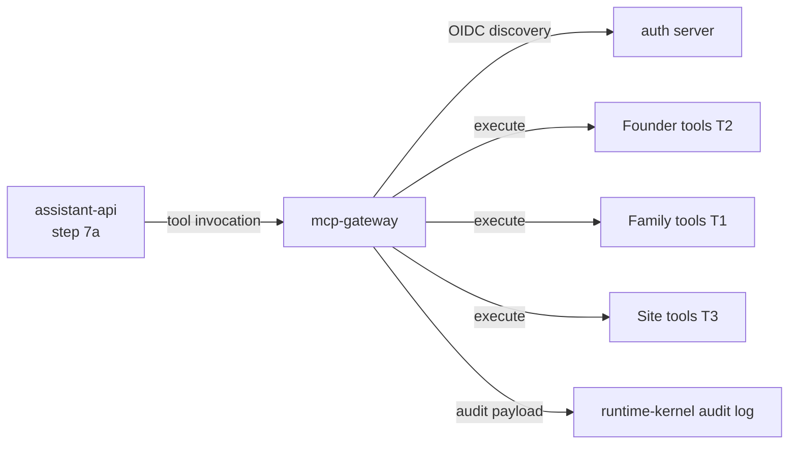

# mcp-gateway

> MCP tool fabric: registry, authentication, invocation, and admission enforcement for all Computer tools. Targets November 2025 MCP stable spec.

---

## Overview

`mcp-gateway` is the **universal tool fabric** for Computer, implementing the Model Context Protocol (November 2025 stable spec). It provides tool registration with admission enforcement, OAuth/OIDC authentication, incremental scope consent, URL-mode elicitation, and structured tool invocation with audit payload.

All tools in Computer are registered here. No tool calls exist outside this package.

See [`docs/architecture/tool-admission-policy.md`](../../docs/architecture/tool-admission-policy.md) and [`docs/architecture/tool-lifecycle-policy.md`](../../docs/architecture/tool-lifecycle-policy.md).

## Responsibilities

- Maintain the canonical tool registry with all admission criteria enforced
- Implement MCP November 2025 spec: OIDC discovery, incremental scope consent, URL-mode elicitation, sampling tool-calling
- Invoke registered tools with structured auth context
- Enforce tool lifecycle stages (Proposed → Active → Deprecated → Removed)
- Return structured tool output with audit payload

**Must NOT:**
- Register tools that lack: primary mode, trust tier, failure mode, eval fixture, audit payload example
- Invoke tools with insufficient auth for their trust tier
- Allow deprecated tools to be invoked without warning

## Architecture



## Tool Registry Summary

| Domain | Count | Trust tier | Mode(s) |
|--------|-------|-----------|---------|
| Founder / work | 8 | T2 | WORK |
| Family / household | 8 | T1 | FAMILY, PERSONAL |
| Site / ops | 6 | T3 | WORK, SITE |

Total registered tools: ≥32. See `registry.py` for full list.

## Tool Admission Policy (hard gate)

Every tool must satisfy all five criteria before registration:

| Criterion | Requirement |
|-----------|-------------|
| Primary mode | One named mode |
| Trust tier | T0–T4 with justification |
| Explicit failure mode | What the tool returns on failure |
| Eval fixture | One entry in `eval-fixtures` |
| Audit payload example | Sample `DecisionRationale` in docstring |

See [`docs/architecture/tool-admission-policy.md`](../../docs/architecture/tool-admission-policy.md).

## MCP November 2025 Features

| Feature | Implementation |
|---------|---------------|
| OIDC discovery | `/.well-known/openid-configuration` alongside AS metadata |
| Incremental scope consent | Re-initiate OAuth on `403 insufficient_scope` |
| URL-mode elicitation | Route `elicitation/create url` through attention-engine |
| Sampling tool-calling | Tool invocation from LLM sampling context |

## Interfaces

### APIs / Endpoints

```
POST /tools/invoke           — invoke a registered tool
GET  /tools                  — list all registered tools
GET  /tools/:name            — tool metadata and admission status
GET  /auth/discovery         — OIDC/OAuth discovery document
GET  /health                 — liveness
```

## Dependencies

### External

| Library | Why |
|---------|-----|
| FastAPI | HTTP service |
| httpx | Tool HTTP invocations |

## Configuration

| Variable | Required | Description |
|----------|----------|-------------|
| `OIDC_ISSUER` | No | OIDC issuer URL for discovery |
| `OAUTH_CLIENT_ID` | No | OAuth client for tool auth |

## Local Development

```bash
task dev:mcp-gateway
```

## Testing

```bash
task test:mcp-gateway
python3 scripts/cli/computer.py tool audit
```

## Failure Modes

| Failure | Behavior | Recovery |
|---------|----------|----------|
| Tool backend unavailable | Returns structured failure with `failure_mode` from registry | Caller handles gracefully |
| Insufficient scope | Returns `403` with scope hint; incremental consent flow triggered | Re-auth with narrower scope |
| Deprecated tool invoked | Returns result with `deprecated: true` warning | Operator should `tool prune` |

## Security / Policy

- Trust tier enforced on every invocation; T2+ tools require founder/operator JWT
- Approval-track actions require passkey-derived claim
- `computer tool audit` surfaces any registered tools that violate admission criteria
