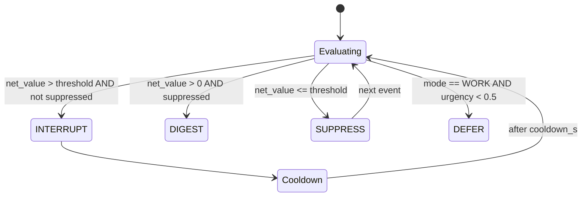

# attention-engine

> CRK step 9: decides whether to INTERRUPT, DIGEST, SUPPRESS, or DEFER based on net attention value, mode, and suppression state.

---

## Overview

`attention-engine` runs at **CRK step 9** for every execution. It evaluates the net attention value of a completed action against the current system mode, active suppression state, and urgency decay, then emits an `AttentionDecision` that determines how the response surfaces to the user.

It is the difference between "Computer interrupts you with everything" and "Computer knows when to stay quiet."

See [`docs/architecture/trust-kpis-and-drift-model.md`](../../docs/architecture/trust-kpis-and-drift-model.md) for the `interrupt_dismissal_rate` and `spoken_regret_rate` KPIs this engine affects.

## Responsibilities

- Compute `net_value` = `urgency × relevance - interruption_cost × mode_weight`
- Apply suppression state machine (ACTIVE → SUPPRESSED → COOLDOWN → ACTIVE)
- Enforce per-mode interrupt thresholds
- Emit `AttentionDecision`: `INTERRUPT | DIGEST | SUPPRESS | DEFER`
- Track `AttentionMemory` for cluster deduplication
- Log all decisions as `ObservationRecord` for KPI tracking

**Must NOT:**
- Modify the response content (that is `runtime-kernel` step 8)
- Make policy decisions about what the system does (it decides only how it surfaces)
- Be bypassed for EMERGENCY mode escalations (EMERGENCY overrides suppression)

## Architecture



## Interfaces

### Inputs

| Source | Protocol | Format | Description |
|--------|----------|--------|-------------|
| `runtime-kernel` | HTTP POST | `AttentionRequest` | Completed action + mode + context |

### Outputs

| Target | Protocol | Format | Description |
|--------|----------|--------|-------------|
| `runtime-kernel` | HTTP response | `AttentionDecision` | INTERRUPT/DIGEST/SUPPRESS/DEFER |

### APIs / Endpoints

```
POST /attention/decide    — evaluate and return AttentionDecision
GET  /attention/state     — current suppression state and cooldown timer
GET  /health              — liveness
```

## Contracts

- [`packages/runtime-contracts`](../../packages/runtime-contracts/) — `AttentionDecision`, `AttentionCost`, `ObservationRecord`

## Configuration

| Variable | Required | Description |
|----------|----------|-------------|
| `INTERRUPT_NET_VALUE_THRESHOLD` | No | Minimum net_value to interrupt (default: `0.0`) |
| `SUPPRESSION_COOLDOWN_S` | No | Cooldown after suppression (default: `300`) |
| `URGENCY_DECAY_RATE` | No | Exponential urgency decay rate (default: `0.1`) |

## Local Development

```bash
task dev:attention-engine
```

## Testing

```bash
task test:attention-engine
pytest services/attention-engine/tests/ -v
```

## Observability

- **Logs**: `decision`, `net_value`, `mode`, `suppression_state`, `trace_id`
- **Metrics**: decision distribution (INTERRUPT/DIGEST/SUPPRESS/DEFER) per mode
- **KPI signal**: `interrupt_dismissal_rate` logged as `ObservationRecord` type `acknowledgment`

## Failure Modes

| Failure | Behavior | Recovery |
|---------|----------|----------|
| Service unavailable | CRK defaults to DIGEST (safe default) | Alert; restart |
| Invalid mode context | Defaults to most restrictive mode settings | Log + alert |

## Security / Policy

- EMERGENCY mode disables suppression unconditionally
- Interrupt threshold tunable via policy tuning console (with `PolicyImpactReport` + replay gate)
- Owner: attention-engine owner (see drift monitor ownership table)
