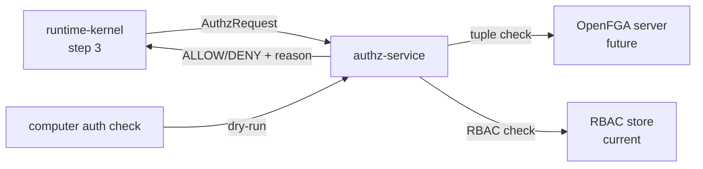

# authz-service

> Authorization service: enforces relationship-based access control (ReBAC) for all Computer actions; migrating from RBAC v1 to OpenFGA Zanzibar-style model.

---

## Overview

`authz-service` is the **authorization authority** for Computer. It runs at CRK step 3 to evaluate whether a caller may perform an action on a resource, using a two-track auth model: session track for normal use and approval track for sensitive actions requiring passkey re-auth.

The service is currently in RBAC v1 with migration to OpenFGA ReBAC underway.

See [`docs/architecture/rebac-auth-evolution.md`](../../docs/architecture/rebac-auth-evolution.md) and [ADR-033](../../docs/adr/ADR-033-rebac-authorization-evolution.md).

## Responsibilities

- Evaluate authorization requests: `(subject, action, resource) → ALLOW | DENY`
- Enforce the two-track auth model (session vs approval)
- Support dry-run auth checks (used by `computer auth check` CLI)
- Provide authorization audit log

**Must NOT:**
- Issue tokens (that is `identity-service`)
- Enforce safety invariants (that is `packages/policy` at CRK step 4)
- Cache authorization decisions beyond a short TTL

## Architecture



## Two-Track Auth Model

| Track | Purpose | Auth mechanism |
|-------|---------|----------------|
| Session track | Identity, browsing, normal household usage | Standard JWT session token |
| Approval track | Sensitive approvals, memory export, policy changes, identity recovery | Passkey re-auth (WebAuthn) |

> **INVARIANT:** Approval-track actions are blocked without passkey re-auth, regardless of session validity.

## Interfaces

### Inputs

| Source | Protocol | Format | Description |
|--------|----------|--------|-------------|
| `runtime-kernel` | HTTP POST | `AuthzRequest` | Authorization check |
| CLI | HTTP POST | `AuthzRequest` | Dry-run check |

### Outputs

| Target | Protocol | Format | Description |
|--------|----------|--------|-------------|
| Callers | HTTP response | `AuthzResult` | ALLOW/DENY + reason + policy path |

### APIs / Endpoints

```
POST /authorize        — evaluate authorization request
POST /authorize/dry-run — dry-run (no side effects, returns decision + reason)
GET  /health           — liveness
```

## Contracts

- [`packages/authz-model`](../../packages/authz-model/) — OpenFGA schema stub (`openfga_schema.fga`)

## Configuration

| Variable | Required | Description |
|----------|----------|-------------|
| `OPENFGA_URL` | No | OpenFGA server (when migrated) |
| `OPENFGA_STORE_ID` | No | Store ID for OpenFGA |
| `RBAC_POLICY_PATH` | Yes | Path to RBAC policy file (current) |

## Local Development

```bash
task dev:authz-service
```

## Testing

```bash
task test:authz-service
```

## Observability

- **Logs**: `subject`, `action`, `resource`, `decision`, `policy_path`, `track`
- **Metrics**: auth denial rate per track; auth latency; `auth_denial_spike` drift monitor

## Failure Modes

| Failure | Behavior | Recovery |
|---------|----------|----------|
| Service unavailable | CRK rejects request with `503` | Auto-retry |
| OpenFGA unavailable (future) | Falls back to RBAC v1 | Alert operator |

## Security / Policy

- Approval track requires passkey-derived claim in JWT; session-only tokens are rejected
- Auth denial spikes trigger drift monitor (see `trust-kpis-and-drift-model.md`)
- Migration path: RBAC v1 → hybrid → full OpenFGA ReBAC (see ADR-033)
