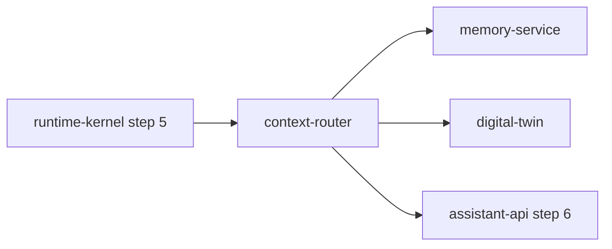

# context-router

> Intent routing + context assembly: classifies incoming requests and assembles the right context window for assistant-api.

---

## Overview

context-router handles classify request intent (voice, text, automation). See the [system architecture](../../README.md) for where it sits in the Computer runtime.

## Responsibilities

- Classify request intent (voice, text, automation)
- Assemble context window: memory, mode, site state, household state
- Emit structured RoutingDecision

**Must NOT:**
- Make policy decisions
- Invoke tools directly

## Architecture



## Interfaces

### Inputs

Receives requests from: `runtime-kernel`, `memory-service`, `digital-twin`

### Outputs

Sends to downstream consumers as described in the architecture diagram above.

### APIs / Endpoints

```
GET  /health    — liveness check
```

## Dependencies

### Internal

| `runtime-kernel` | (step 5 caller) |
| `memory-service` | (context reads) |
| `digital-twin` | (asset state) |
| `assistant-api` | (consumer) |

### External

| Library | Why |
|---------|-----|
| FastAPI | HTTP service |
| structlog | Structured logging |

## Configuration

| Variable | Required | Description |
|----------|----------|-------------|
| `SERVICE_URL` | Yes | Downstream service URL |

## Local Development

```bash
task dev:context-router
```

## Testing

```bash
task test:context-router
```

## Observability

- **Logs**: structured JSON with `trace_id` and relevant domain fields
- **Traces**: OpenTelemetry spans forwarded to collector

## Failure Modes

| Failure | Behavior | Recovery |
|---------|----------|----------|
| Downstream unavailable | Returns `503` with retry hint | Auto-retry with backoff |
| Invalid input | Returns `422` | Caller fixes request |

## Security / Policy

- Receives pre-validated context from upstream services
- No direct external access
