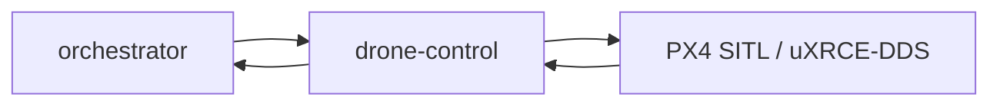

# drone-control

> PX4 drone control stub: supervised-only drone operations via PX4 SITL bridge; no autonomous flight without operator approval.

---

## Overview

drone-control handles bridge orchestrator mission commands to px4. See the [system architecture](../../README.md) for where it sits in the Computer runtime.

## Responsibilities

- Bridge orchestrator mission commands to PX4
- Enforce supervised-only constraint (ADR-005)
- Report telemetry and command_ack

**Must NOT:**
- Execute autonomous flight without operator approval
- Override safety interlocks

## Architecture



## Interfaces

### Inputs

Receives requests from: `orchestrator`, `PX4`

### Outputs

Sends to downstream consumers as described in the architecture diagram above.

### APIs / Endpoints

```
GET  /health    — liveness check
```

## Dependencies

### Internal

| `orchestrator` | (mission dispatch) |
| `PX4` | SITL (flight execution) |

### External

| Library | Why |
|---------|-----|
| FastAPI | HTTP service |
| structlog | Structured logging |

## Configuration

| Variable | Required | Description |
|----------|----------|-------------|
| `SERVICE_URL` | Yes | Downstream service URL |

## Local Development

```bash
task dev:drone-control
```

## Testing

```bash
task test:drone-control
```

## Observability

- **Logs**: structured JSON with `trace_id` and relevant domain fields
- **Traces**: OpenTelemetry spans forwarded to collector

## Failure Modes

| Failure | Behavior | Recovery |
|---------|----------|----------|
| Downstream unavailable | Returns `503` with retry hint | Auto-retry with backoff |
| Invalid input | Returns `422` | Caller fixes request |

## Security / Policy

- Receives pre-validated context from upstream services
- No direct external access
