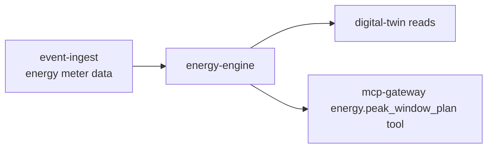

# energy-engine

> Energy optimization: models site energy consumption, detects peak windows, and recommends load-shifting actions.

---

## Overview

energy-engine handles model current and predicted site energy consumption. See the [system architecture](../../README.md) for where it sits in the Computer runtime.

## Responsibilities

- Model current and predicted site energy consumption
- Detect and forecast peak pricing windows
- Provide peak_window_plan tool output for mcp-gateway

**Must NOT:**
- Directly control loads (routes through orchestrator)

## Architecture



## Interfaces

### Inputs

Receives requests from: `event-ingest`, `digital-twin`, `mcp-gateway`

### Outputs

Sends to downstream consumers as described in the architecture diagram above.

### APIs / Endpoints

```
GET  /health    — liveness check
```

## Dependencies

### Internal

| `event-ingest` | (meter readings) |
| `digital-twin` | (load state) |
| `mcp-gateway` | (tool output) |

### External

| Library | Why |
|---------|-----|
| FastAPI | HTTP service |
| structlog | Structured logging |

## Configuration

| Variable | Required | Description |
|----------|----------|-------------|
| `SERVICE_URL` | Yes | Downstream service URL |

## Local Development

```bash
task dev:energy-engine
```

## Testing

```bash
task test:energy-engine
```

## Observability

- **Logs**: structured JSON with `trace_id` and relevant domain fields
- **Traces**: OpenTelemetry spans forwarded to collector

## Failure Modes

| Failure | Behavior | Recovery |
|---------|----------|----------|
| Downstream unavailable | Returns `503` with retry hint | Auto-retry with backoff |
| Invalid input | Returns `422` | Caller fixes request |

## Security / Policy

- Receives pre-validated context from upstream services
- No direct external access
