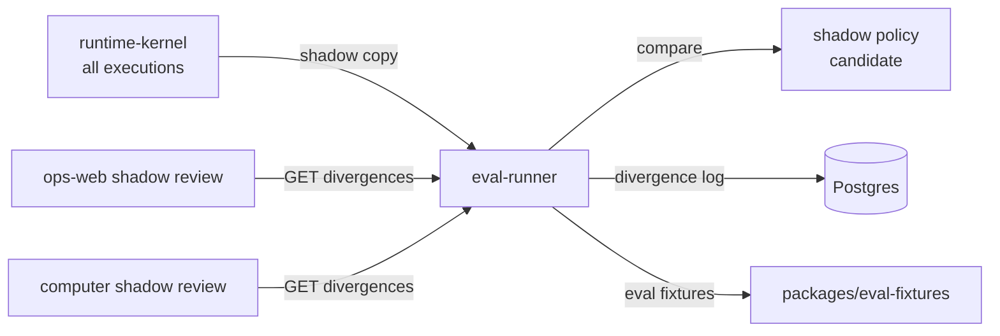

# eval-runner

> Behavioral evaluation service: runs voice evals, trust metric fixtures, shadow mode comparisons, and canary policy rollout health.

---

## Overview

`eval-runner` is the **standing measurement layer** for Computer. It runs behavioral evaluation fixtures, compares live policy decisions against shadow policy, manages canary rollouts, and surfaces divergence for operator review. It turns "all tests pass" into "real-world decisions are calibrated."

See [`docs/delivery/field-truth-and-shadow-mode.md`](../../docs/delivery/field-truth-and-shadow-mode.md).

## Responsibilities

- Run behavioral eval fixtures from `packages/eval-fixtures`
- Record `ShadowComparison` divergences between live and shadow policy
- Manage baseline policy freeze windows for clean A/B comparison
- Track canary rollout health and trigger rollback on threshold breach
- Expose divergence review queue for operator inspection

**Must NOT:**
- Modify live policy (read-only against current policy)
- Auto-publish policy changes (that is gated by policy-publish-gate)
- Run evals on production traffic without explicit shadow mode activation

## Architecture



## Interfaces

### APIs / Endpoints

```
POST /eval/shadow                    — log shadow comparison
GET  /eval/shadow/divergences        — divergence log [?limit=50&type=attention|routing|tool_selection]
POST /eval/shadow/baseline/freeze    — pin current policy as baseline
GET  /eval/shadow/canary/status      — canary rollout health
POST /eval/run                       — run eval fixture suite
GET  /health                         — liveness
```

## Contracts

- [`packages/eval-fixtures`](../../packages/eval-fixtures/) — `VoiceEvalFixture`, `AssistantEvalFixture`, scenario definitions

## Configuration

| Variable | Required | Description |
|----------|----------|-------------|
| `DATABASE_URL` | Yes | Postgres for divergence log |
| `SHADOW_DIVERGENCE_THRESHOLD` | No | Rollback trigger rate (default: `0.20`) |
| `BASELINE_POLICY_VERSION` | No | Set on freeze; compared against live |

## Local Development

```bash
task dev:eval-runner
```

## Testing

```bash
task test:eval-runner
```

## Observability

- **Logs**: `divergence_type`, `live_decision`, `shadow_decision`, `policy_version`
- **Metrics**: divergence rate per type, canary exposure %, rollback trigger count

## Failure Modes

| Failure | Behavior | Recovery |
|---------|----------|----------|
| Shadow mode disabled | No comparisons logged; eval fixtures still run | Re-enable shadow mode |
| Canary divergence > threshold | Rollback triggered; alert fired | Operator reviews divergences |
