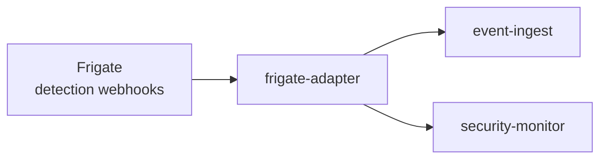

# frigate-adapter

> Frigate camera/detection adapter: normalizes Frigate detection events into AssetEvent format for site security awareness.

---

## Overview

frigate-adapter handles receive frigate detection webhooks. See the [system architecture](../../README.md) for where it sits in the Computer runtime.

## Responsibilities

- Receive Frigate detection webhooks
- Normalize to AssetEvent with confidence score
- Forward high-confidence detections to security-monitor

**Must NOT:**
- Store raw video
- Make security decisions directly

## Architecture



## Interfaces

### Inputs

Receives requests from: `event-ingest`, `security-monitor`

### Outputs

Sends to downstream consumers as described in the architecture diagram above.

### APIs / Endpoints

```
GET  /health    — liveness check
```

## Dependencies

### Internal

| `event-ingest` |  |
| `security-monitor` |  |

### External

| Library | Why |
|---------|-----|
| FastAPI | HTTP service |
| structlog | Structured logging |

## Configuration

| Variable | Required | Description |
|----------|----------|-------------|
| `SERVICE_URL` | Yes | Downstream service URL |

## Local Development

```bash
task dev:frigate-adapter
```

## Testing

```bash
task test:frigate-adapter
```

## Observability

- **Logs**: structured JSON with `trace_id` and relevant domain fields
- **Traces**: OpenTelemetry spans forwarded to collector

## Failure Modes

| Failure | Behavior | Recovery |
|---------|----------|----------|
| Downstream unavailable | Returns `503` with retry hint | Auto-retry with backoff |
| Invalid input | Returns `422` | Caller fixes request |

## Security / Policy

- Receives pre-validated context from upstream services
- No direct external access
