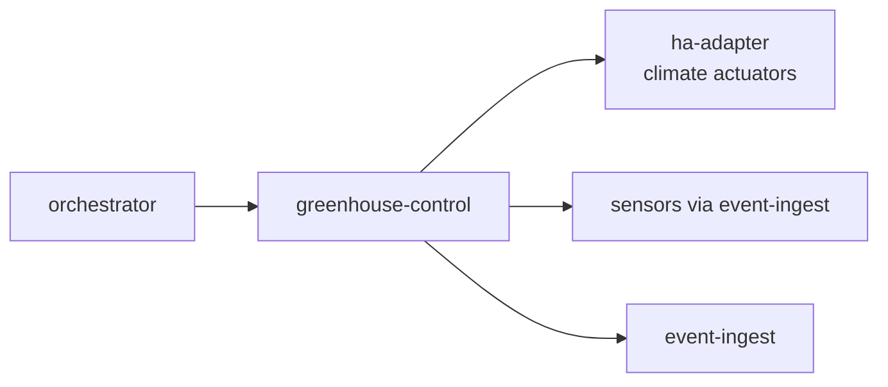

# greenhouse-control

> Greenhouse automation: manages climate, irrigation schedules, sensor monitoring, and anomaly alerts for controlled-environment growing.

---

## Overview

greenhouse-control handles execute climate and irrigation routines from orchestrator. See the [system architecture](../../README.md) for where it sits in the Computer runtime.

## Responsibilities

- Execute climate and irrigation routines from orchestrator
- Monitor sensor readings for anomalies
- Emit AssetEvent on anomaly for site awareness

**Must NOT:**
- Self-schedule routines without orchestrator (except emergency safety cutoff)

## Architecture



## Interfaces

### Inputs

Receives requests from: `orchestrator`, `ha-adapter`, `event-ingest`

### Outputs

Sends to downstream consumers as described in the architecture diagram above.

### APIs / Endpoints

```
GET  /health    — liveness check
```

## Dependencies

### Internal

| `orchestrator` | (routine dispatch) |
| `ha-adapter` | (actuator control) |
| `event-ingest` | (sensor data) |

### External

| Library | Why |
|---------|-----|
| FastAPI | HTTP service |
| structlog | Structured logging |

## Configuration

| Variable | Required | Description |
|----------|----------|-------------|
| `SERVICE_URL` | Yes | Downstream service URL |

## Local Development

```bash
task dev:greenhouse-control
```

## Testing

```bash
task test:greenhouse-control
```

## Observability

- **Logs**: structured JSON with `trace_id` and relevant domain fields
- **Traces**: OpenTelemetry spans forwarded to collector

## Failure Modes

| Failure | Behavior | Recovery |
|---------|----------|----------|
| Downstream unavailable | Returns `503` with retry hint | Auto-retry with backoff |
| Invalid input | Returns `422` | Caller fixes request |

## Security / Policy

- Receives pre-validated context from upstream services
- No direct external access
