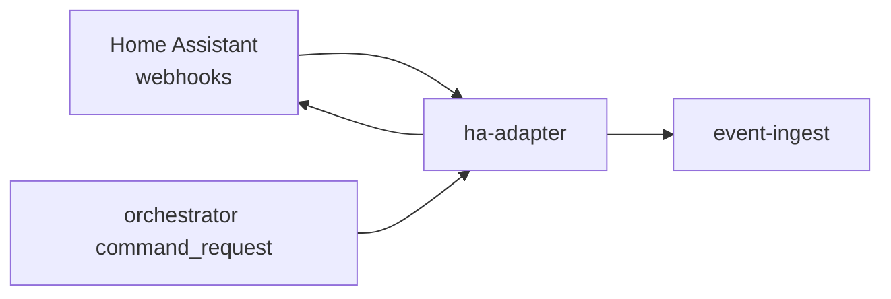

# ha-adapter

> Home Assistant integration: translates HA state changes into canonical AssetEvent format and forwards commands from orchestrator.

---

## Overview

ha-adapter handles receive ha state webhooks and normalize to assetevent. See the [system architecture](../../README.md) for where it sits in the Computer runtime.

## Responsibilities

- Receive HA state webhooks and normalize to AssetEvent
- Forward orchestrator commands to HA REST API
- Map HA entity IDs to canonical Computer asset IDs

**Must NOT:**
- Perform policy evaluation
- Invoke HA directly from AI paths (must go through orchestrator)

## Architecture



## Interfaces

### Inputs

Receives requests from: `event-ingest`, `orchestrator`

### Outputs

Sends to downstream consumers as described in the architecture diagram above.

### APIs / Endpoints

```
GET  /health    — liveness check
```

## Dependencies

### Internal

| `event-ingest` | (asset event forwarding) |
| `orchestrator` | (command forwarding to HA) |

### External

| Library | Why |
|---------|-----|
| FastAPI | HTTP service |
| structlog | Structured logging |

## Configuration

| Variable | Required | Description |
|----------|----------|-------------|
| `SERVICE_URL` | Yes | Downstream service URL |

## Local Development

```bash
task dev:ha-adapter
```

## Testing

```bash
task test:ha-adapter
```

## Observability

- **Logs**: structured JSON with `trace_id` and relevant domain fields
- **Traces**: OpenTelemetry spans forwarded to collector

## Failure Modes

| Failure | Behavior | Recovery |
|---------|----------|----------|
| Downstream unavailable | Returns `503` with retry hint | Auto-retry with backoff |
| Invalid input | Returns `422` | Caller fixes request |

## Security / Policy

- Receives pre-validated context from upstream services
- No direct external access
