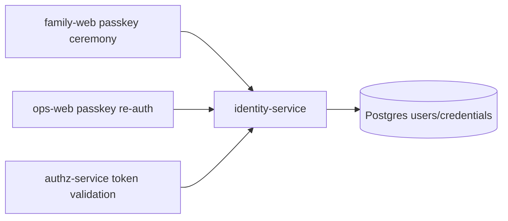

# identity-service

> Authentication authority: issues JWT tokens, manages WebAuthn/passkey ceremonies, and validates identity claims.

---

## Overview

identity-service handles issue jwt tokens (session and approval tracks). See the [system architecture](../../README.md) for where it sits in the Computer runtime.

## Responsibilities

- Issue JWT tokens (session and approval tracks)
- Manage WebAuthn/passkey registration and authentication ceremonies
- Validate tokens on behalf of authz-service

**Must NOT:**
- Make authorization decisions (that is authz-service)
- Dispatch site-control actions

## Architecture



## Interfaces

### Inputs

Receives requests from: `family-web`, `ops-web`, `authz-service`

### Outputs

Sends to downstream consumers as described in the architecture diagram above.

### APIs / Endpoints

```
GET  /health    — liveness check
```

## Dependencies

### Internal

| `family-web` | (passkey ceremonies) |
| `ops-web` | (approval re-auth) |
| `authz-service` | (token validation) |

### External

| Library | Why |
|---------|-----|
| FastAPI | HTTP service |
| structlog | Structured logging |

## Configuration

| Variable | Required | Description |
|----------|----------|-------------|
| `SERVICE_URL` | Yes | Downstream service URL |

## Local Development

```bash
task dev:identity-service
```

## Testing

```bash
task test:identity-service
```

## Observability

- **Logs**: structured JSON with `trace_id` and relevant domain fields
- **Traces**: OpenTelemetry spans forwarded to collector

## Failure Modes

| Failure | Behavior | Recovery |
|---------|----------|----------|
| Downstream unavailable | Returns `503` with retry hint | Auto-retry with backoff |
| Invalid input | Returns `422` | Caller fixes request |

## Security / Policy

- Receives pre-validated context from upstream services
- No direct external access
