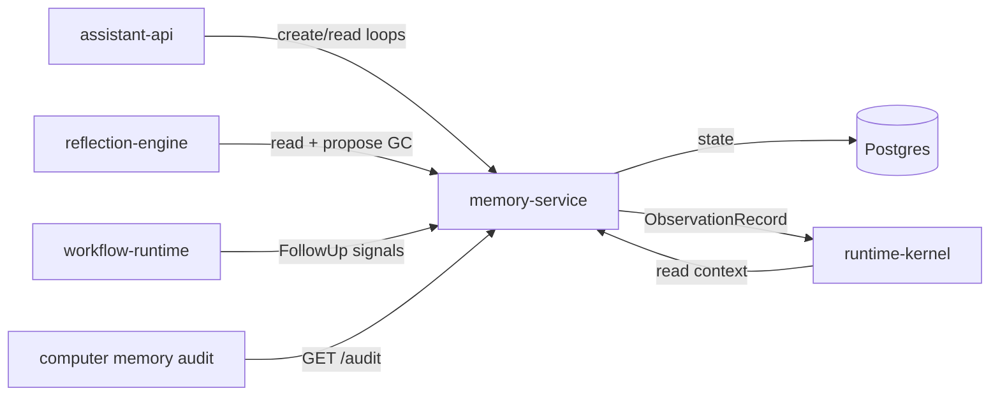

# memory-service

> Open-loop and commitment lifecycle manager: tracks all active loops, commitments, and follow-ups with freshness decay, hazard detection, and scope enforcement.

---

## Overview

`memory-service` manages the **lifecycle of Computer's working memory**: open loops, commitments, and follow-ups. It applies freshness decay, detects hazardous accumulation, enforces cross-scope access control, and provides audit surfaces. It does not store raw conversation history.

See [`docs/architecture/system-state-model.md`](../../docs/architecture/system-state-model.md) and the memory lifecycle policy in `packages/policy`.

## Responsibilities

- Create, update, and close `OpenLoop`, `Commitment`, and `FollowUp` records
- Apply freshness decay (exponential, configurable rate)
- Detect and flag hazardous memory states (stale loops, scope conflicts)
- Enforce cross-scope access control (T0/T1 scope boundaries)
- Provide memory audit API for `computer memory audit` CLI
- Emit `ObservationRecord` for all lifecycle transitions

**Must NOT:**
- Store raw conversation transcripts
- Perform cross-scope reads without explicit sharing authorization
- Trigger actions directly (transitions are observations, not commands)

## Architecture



## Interfaces

### APIs / Endpoints

```
POST /loops              — create open loop
GET  /loops              — list by user/scope/status
GET  /loops/:id          — get loop with freshness
POST /loops/:id/close    — close loop
GET  /audit              — memory audit report (freshness, hazards, growth)
GET  /health             — liveness
```

## Contracts

- [`packages/runtime-contracts`](../../packages/runtime-contracts/) — `OpenLoop`, `Commitment`, `FollowUp`, `ObservationRecord`

## Configuration

| Variable | Required | Description |
|----------|----------|-------------|
| `DATABASE_URL` | Yes | Postgres connection string |
| `DECAY_RATE` | No | Freshness decay rate (default: `0.03`) |
| `MAX_LOOP_AGE_DAYS` | No | Max age before ABANDONED transition (default: `90`) |
| `HAZARD_LOOP_COUNT_THRESHOLD` | No | Alert threshold for active loop count (default: `50`) |

## Local Development

```bash
task dev:memory-service
```

## Testing

```bash
task test:memory-service
pytest tests/long_horizon/test_memory_pressure.py -v
```

## Observability

- **Logs**: `loop_id`, `transition`, `freshness`, `scope`, `user_id`
- **Metrics**: active loop count, decay rate distribution, abandonment rate
- **Drift monitor**: Memory growth > 5%/day without closure triggers alarm (owner: memory-service owner)

## Failure Modes

| Failure | Behavior | Recovery |
|---------|----------|----------|
| Postgres unavailable | Returns `503`; no writes | Restart when DB recovers |
| Decay job failure | Loops don't decay; alert fired | Manual trigger via CLI |

## Security / Policy

- Scope boundaries enforced on every read: T0 (personal) data never readable at T1 (family) scope without explicit `memory.share_explicit` tool invocation
- `computer memory audit` provides dry-run GC recommendations; does not modify state
