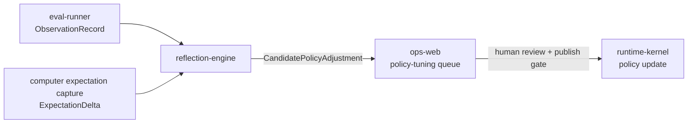

# reflection-engine

> Constrained policy adaptation engine: proposes `CandidatePolicyAdjustment` objects based on calibration signals and `ExpectationDelta` corrections; never self-modifies.

---

## Overview

`reflection-engine` ingests calibration signals, trust KPI readings, and `ExpectationDelta` corrections to generate structured `CandidatePolicyAdjustment` proposals. All proposals require human review and the policy publish gate before taking effect. The engine cannot modify any policy or invariant directly.

## Responsibilities

- Read `ObservationRecord` events and `ExpectationDelta` corrections from eval fixtures
- Detect systematic patterns (repeated corrections of same type, KPI drift)
- Generate `CandidatePolicyAdjustment` proposals with evidence
- Route proposals to operator review queue in `ops-web`
- Never modify policy, memory, or invariants directly

**Must NOT:**
- Apply policy changes without operator approval and publish gate
- Modify safety invariants under any circumstances (Invariant I-06)
- Generate proposals without evidence threshold (minimum 5 corroborating signals)

## Architecture



## Interfaces

### APIs / Endpoints

```
GET  /proposals              — list pending CandidatePolicyAdjustment proposals
GET  /proposals/:id          — get proposal detail with evidence
POST /proposals/:id/dismiss  — dismiss proposal (operator)
GET  /health                 — liveness
```

## Contracts

- [`packages/runtime-contracts`](../../packages/runtime-contracts/) — `ExpectationDelta`, `ObservationRecord`
- `CandidatePolicyAdjustment` (internal type with evidence chain)

## Configuration

| Variable | Required | Description |
|----------|----------|-------------|
| `MIN_EVIDENCE_THRESHOLD` | No | Min corroborating signals to generate proposal (default: `5`) |
| `OBSERVATION_WINDOW_DAYS` | No | Window for pattern detection (default: `7`) |

## Local Development

```bash
task dev:reflection-engine
```

## Failure Modes

| Failure | Behavior | Recovery |
|---------|----------|----------|
| No signals in window | No proposals generated | Normal — system is stable |
| Evidence below threshold | Proposal not generated | Accumulate more signals |

## Security / Policy

- Invariant I-06: reflection engine cannot modify safety invariants under any conditions
- All proposals require operator review; no auto-apply path exists
