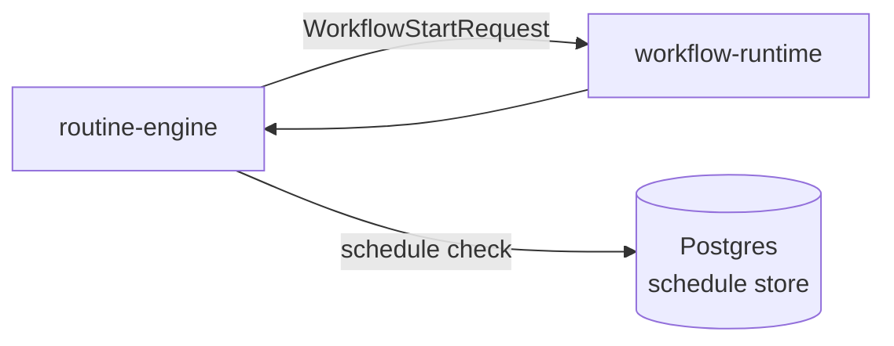

# routine-engine

> Household and site routine scheduler: generates RoutineWorkflow triggers based on configured schedules and contextual conditions.

---

## Overview

routine-engine handles evaluate configured routine schedules against current context. See the [system architecture](../../README.md) for where it sits in the Computer runtime.

## Responsibilities

- Evaluate configured routine schedules against current context
- Generate WorkflowStartRequest for RoutineWorkflow
- Skip routines when context conditions not met

**Must NOT:**
- Execute routines directly without workflow-runtime
- Modify schedules without operator review

## Architecture



## Interfaces

### Inputs

Receives requests from: `workflow-runtime`, `memory-service`

### Outputs

Sends to downstream consumers as described in the architecture diagram above.

### APIs / Endpoints

```
GET  /health    — liveness check
```

## Dependencies

### Internal

| `workflow-runtime` | (routine dispatch) |
| `memory-service` | (context reads) |

### External

| Library | Why |
|---------|-----|
| FastAPI | HTTP service |
| structlog | Structured logging |

## Configuration

| Variable | Required | Description |
|----------|----------|-------------|
| `SERVICE_URL` | Yes | Downstream service URL |

## Local Development

```bash
task dev:routine-engine
```

## Testing

```bash
task test:routine-engine
```

## Observability

- **Logs**: structured JSON with `trace_id` and relevant domain fields
- **Traces**: OpenTelemetry spans forwarded to collector

## Failure Modes

| Failure | Behavior | Recovery |
|---------|----------|----------|
| Downstream unavailable | Returns `503` with retry hint | Auto-retry with backoff |
| Invalid input | Returns `422` | Caller fixes request |

## Security / Policy

- Receives pre-validated context from upstream services
- No direct external access
