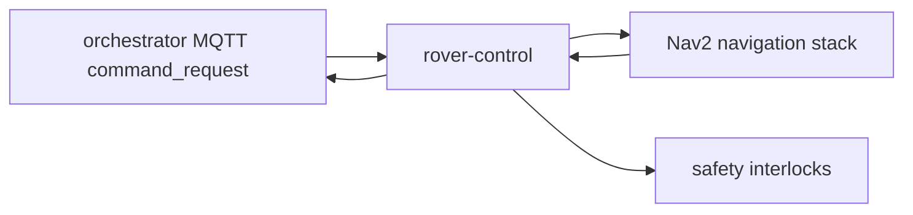

# rover-control

> Rover mission executor: receives mission commands from orchestrator, manages Nav2 navigation, and enforces safety interlocks.

---

## Overview

rover-control handles receive and validate mission commands from orchestrator. See the [system architecture](../../README.md) for where it sits in the Computer runtime.

## Responsibilities

- Receive and validate mission commands from orchestrator
- Execute Nav2 navigation plans
- Enforce safety interlocks (Invariant I-04)
- Report command_ack to orchestrator

**Must NOT:**
- Accept commands from AI paths directly (only from orchestrator)
- Execute missions during active safety interlocks

## Architecture



## Interfaces

### Inputs

Receives requests from: `orchestrator`, `Nav2`, `digital-twin`

### Outputs

Sends to downstream consumers as described in the architecture diagram above.

### APIs / Endpoints

```
GET  /health    — liveness check
```

## Dependencies

### Internal

| `orchestrator` | (mission dispatch) |
| `Nav2` | (navigation execution) |
| `digital-twin` | (obstacle state) |

### External

| Library | Why |
|---------|-----|
| FastAPI | HTTP service |
| structlog | Structured logging |

## Configuration

| Variable | Required | Description |
|----------|----------|-------------|
| `SERVICE_URL` | Yes | Downstream service URL |

## Local Development

```bash
task dev:rover-control
```

## Testing

```bash
task test:rover-control
```

## Observability

- **Logs**: structured JSON with `trace_id` and relevant domain fields
- **Traces**: OpenTelemetry spans forwarded to collector

## Failure Modes

| Failure | Behavior | Recovery |
|---------|----------|----------|
| Downstream unavailable | Returns `503` with retry hint | Auto-retry with backoff |
| Invalid input | Returns `422` | Caller fixes request |

## Security / Policy

- Receives pre-validated context from upstream services
- No direct external access
