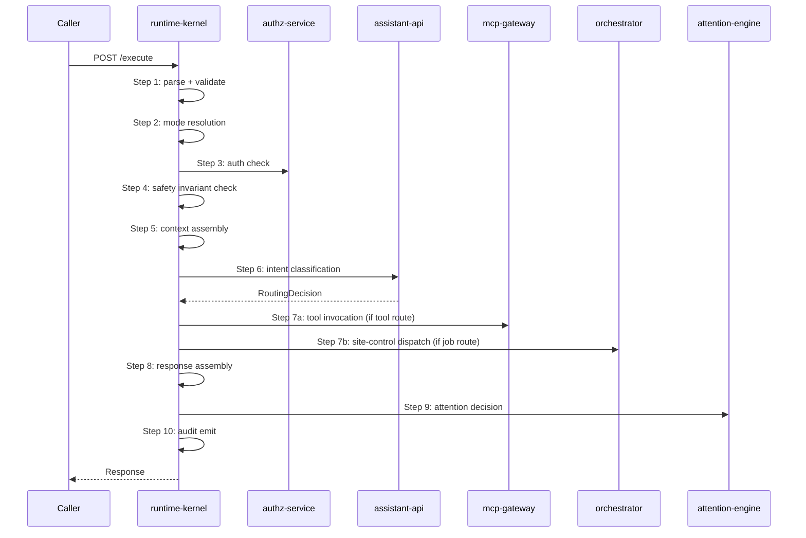

# runtime-kernel

> Computer Runtime Kernel (CRK): single lifecycle owner for all request execution; runs the 10-step loop that binds tools, auth, attention, and assistant behavior into one coherent runtime.

---

## Overview

`runtime-kernel` is the **sole entry point for all Computer requests**. It enforces a strict 10-step execution loop that binds together authentication, context assembly, intent routing, tool invocation, site-control dispatch, attention decisions, and audit. No subsystem may bypass it.

See [`docs/architecture/runtime-kernel.md`](../../docs/architecture/runtime-kernel.md) and [`docs/architecture/kernel-authority-model.md`](../../docs/architecture/kernel-authority-model.md).

## Responsibilities

- Accept all requests via `POST /execute`
- Enforce the 10-step CRK execution loop (see below)
- Maintain `ExecutionContext` through all steps
- Enforce safety invariants at step 4 before any action
- Split tool invocation (step 7a) from site-control dispatch (step 7b)
- Emit structured audit records for every execution
- Own mode transitions and stickiness rules

**Must NOT:**
- Be bypassed by any service for any reason
- Perform AI reasoning (that is `assistant-api`)
- Perform site-control dispatch without safety check (step 4)
- Modify memory directly (routes through `memory-service`)

## Architecture



## The 10-Step Execution Loop

| Step | Name | Owner |
|------|------|-------|
| 1 | Parse + validate | runtime-kernel |
| 2 | Mode resolution | runtime-kernel |
| 3 | Authorization check | authz-service |
| 4 | Safety invariant enforcement | packages/policy |
| 5 | Context assembly | context-router |
| 6 | Intent classification | assistant-api |
| 7a | Tool invocation | mcp-gateway |
| 7b | Site-control dispatch | orchestrator |
| 8 | Response assembly | runtime-kernel |
| 9 | Attention decision | attention-engine |
| 10 | Audit emit | runtime-kernel |

## Interfaces

### Inputs

| Source | Protocol | Format | Description |
|--------|----------|--------|-------------|
| All callers | HTTP POST | `ExecutionRequest` | Any Computer request |

### Outputs

| Target | Protocol | Format | Description |
|--------|----------|--------|-------------|
| Callers | HTTP response | `ExecutionResponse` | Decision + response |
| Audit log | File/Postgres | `DecisionRationale` JSONL | Full execution record |

### APIs / Endpoints

```
POST /execute         — primary entry point for all requests
GET  /audit/:trace_id — retrieve audit record for execution
GET  /mode            — current system mode
POST /mode            — set system mode (operator only)
GET  /health          — liveness
```

## Contracts

- [`packages/runtime-contracts`](../../packages/runtime-contracts/) — all CRK types: `ExecutionContext`, `ControlAction`, `DecisionRationale`, `AttentionDecision`, `ConfidenceScore`
- [`packages/policy`](../../packages/policy/) — safety invariants

## Dependencies

### Internal

| Service/Package | Why |
|-----------------|-----|
| `authz-service` | Step 3 auth check |
| `assistant-api` | Step 6 intent classification |
| `mcp-gateway` | Step 7a tool invocation |
| `orchestrator` | Step 7b site-control dispatch |
| `attention-engine` | Step 9 attention decision |
| `packages/policy` | Step 4 safety invariants |
| `packages/runtime-contracts` | All typed CRK objects |

## Configuration

| Variable | Required | Description |
|----------|----------|-------------|
| `AUTHZ_SERVICE_URL` | Yes | Authorization service endpoint |
| `ASSISTANT_API_URL` | Yes | Assistant reasoning endpoint |
| `MCP_GATEWAY_URL` | Yes | Tool fabric endpoint |
| `ORCHESTRATOR_URL` | Yes | Site-control dispatch endpoint |
| `ATTENTION_ENGINE_URL` | Yes | Attention decision endpoint |
| `AUDIT_LOG_PATH` | Yes | Path for JSONL audit log |
| `DEFAULT_MODE` | No | Starting system mode (default: `PERSONAL`) |

## Local Development

```bash
task dev:runtime-kernel
```

## Testing

```bash
task test:runtime-kernel
pytest services/runtime-kernel/tests/ -v
```

## Observability

- **Logs**: every step logged with `trace_id`, `step`, `duration_ms`, `decision`
- **Audit log**: `audit_log.jsonl` — full `DecisionRationale` per execution
- **Traces**: OpenTelemetry spans for each of the 10 steps

## Failure Modes

| Failure | Behavior | Recovery |
|---------|----------|----------|
| `authz-service` unavailable | Step 3 fails; request rejected with `503` | Auto-retry with backoff |
| Safety invariant violated | Step 4 rejects; returns `403` with invariant ID | No retry; operator review |
| `assistant-api` unavailable | Falls back to cached/scripted response | Alert; degrade to conservative mode |
| Audit emit fails | Request completes; audit failure logged separately | Operator review for audit gaps |

## Security / Policy

- All requests require caller identity (session token or passkey-derived context)
- Safety invariants enforced at step 4 unconditionally; no override path
- Mode transitions require T2 trust tier (founder/operator)
- Full audit trail for every execution; no silent decisions
