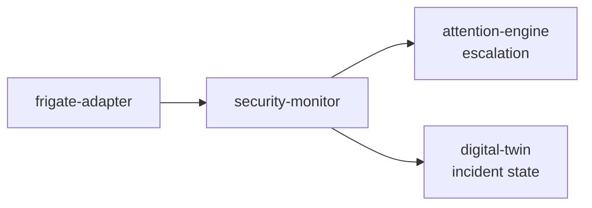

# security-monitor

> Site security awareness: aggregates detection events, maintains incident timeline, and escalates to attention-engine on threat detection.

---

## Overview

security-monitor handles aggregate detection events into security context. See the [system architecture](../../README.md) for where it sits in the Computer runtime.

## Responsibilities

- Aggregate detection events into security context
- Maintain incident timeline
- Escalate high-confidence threats to attention-engine

**Must NOT:**
- Make autonomous response decisions
- Control actuators directly

## Architecture



## Interfaces

### Inputs

Receives requests from: `frigate-adapter`, `attention-engine`, `digital-twin`

### Outputs

Sends to downstream consumers as described in the architecture diagram above.

### APIs / Endpoints

```
GET  /health    — liveness check
```

## Dependencies

### Internal

| `frigate-adapter` | (detection events) |
| `attention-engine` | (escalation) |
| `digital-twin` | (incident state) |

### External

| Library | Why |
|---------|-----|
| FastAPI | HTTP service |
| structlog | Structured logging |

## Configuration

| Variable | Required | Description |
|----------|----------|-------------|
| `SERVICE_URL` | Yes | Downstream service URL |

## Local Development

```bash
task dev:security-monitor
```

## Testing

```bash
task test:security-monitor
```

## Observability

- **Logs**: structured JSON with `trace_id` and relevant domain fields
- **Traces**: OpenTelemetry spans forwarded to collector

## Failure Modes

| Failure | Behavior | Recovery |
|---------|----------|----------|
| Downstream unavailable | Returns `503` with retry hint | Auto-retry with backoff |
| Invalid input | Returns `422` | Caller fixes request |

## Security / Policy

- Receives pre-validated context from upstream services
- No direct external access
