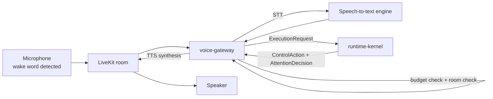

# voice-gateway

> Voice interface: LiveKit-backed STT/TTS pipeline with turn detection, barge-in recovery, room-aware routing, and spoken-length budget enforcement.

---

## Overview

`voice-gateway` translates voice interactions into CRK `ExecutionRequest` objects and routes CRK responses back to audio. It enforces **voice quality engineering contracts**: spoken-length budgets per mode, silence quality as a first-class metric, false interruption recovery, and room-aware surface routing.

See [`docs/product/voice-quality-engineering.md`](../../docs/product/voice-quality-engineering.md).

## Responsibilities

- Manage LiveKit room sessions and VAD/wake-word pipeline
- Convert STT output to `ExecutionRequest` for `runtime-kernel`
- Enforce spoken-length budgets per mode before TTS synthesis
- Detect and recover from false barge-in events
- Route to `family-web` or digest instead of speaking for multi-step/visual content
- Track `spoken_regret_rate`: stop/not-now/don't-say-that signals
- Enforce room context: no private content in shared-room voice output

**Must NOT:**
- Bypass `runtime-kernel` for response generation
- Speak private/sensitive content detected by room context check
- Generate responses longer than per-mode budget without truncation

## Architecture



## Spoken-Length Budgets

| Mode | Max sentences | Overflow handling |
|------|--------------|-------------------|
| PERSONAL | 2 | Truncate + offer digest |
| FAMILY | 3 | Truncate + offer family-web |
| WORK | 4 | Truncate + offer ops-web |
| EMERGENCY | 1 | Hard truncate |

## Interfaces

### Inputs

| Source | Protocol | Format | Description |
|--------|----------|--------|-------------|
| LiveKit | WebRTC | Audio frames | Voice input |
| `runtime-kernel` | HTTP response | `ControlAction` | Response to speak |

### Outputs

| Target | Protocol | Format | Description |
|--------|----------|--------|-------------|
| LiveKit | WebRTC | Audio frames | TTS output |
| `runtime-kernel` | HTTP POST | `ExecutionRequest` | Voice-triggered requests |

### APIs / Endpoints

```
POST /session/start     — start voice session for user/room
POST /session/end       — end voice session
GET  /session/:id       — session state
GET  /health            — liveness
```

## Configuration

| Variable | Required | Description |
|----------|----------|-------------|
| `LIVEKIT_URL` | Yes | LiveKit server URL |
| `LIVEKIT_API_KEY` | Yes | LiveKit API key |
| `LIVEKIT_API_SECRET` | Yes | LiveKit API secret |
| `RUNTIME_KERNEL_URL` | Yes | CRK endpoint |
| `BARGE_IN_THRESHOLD_MS` | No | False barge-in recovery window (default: `300`) |

## Local Development

```bash
task dev:voice-gateway
```

## Testing

```bash
task test:voice-gateway
pytest packages/eval-fixtures/eval_fixtures/voice_evals.py -v
```

## Observability

- **Logs**: `session_id`, `room`, `mode`, `utterance_length`, `spoken_sentences`, `regret_event`
- **Metrics**: `spoken_regret_rate`, `barge_in_false_positive_rate`, `budget_exceeded_rate` per mode

## Failure Modes

| Failure | Behavior | Recovery |
|---------|----------|----------|
| LiveKit unavailable | Falls back to text-only mode; alert fired | Restart LiveKit session |
| Room context check fails | Suppresses response; routes to digest | Safe default |
| Budget exceeded | Truncates; appends "see [surface] for details" | By design |

## Security / Policy

- Private content suppressed in shared-room context (Invariant I-03)
- `spoken_regret_rate` is a leading indicator of voice trust failure; drift monitor triggers at > 15%
- Room context from `digital-twin` asset state; not from voice gateway internal state
