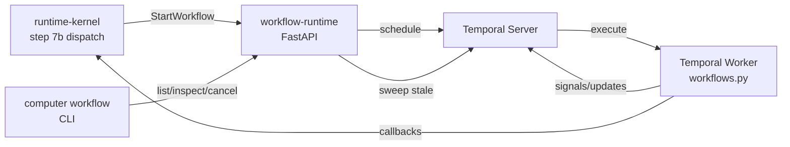

# workflow-runtime

> Temporal-backed durable workflow engine: manages long-running reminders, approvals, routines, and follow-ups with fault-tolerant resumability.

---

## Overview

`workflow-runtime` is the **production backbone for all long-lived, stateful processes** in Computer. It uses the Temporal Python SDK to implement four canonical workflow classes that back household routines, founder follow-ups, family approvals, and durable reminders.

All workflow classes are registered in a structured registry. No new workflow class ships without an ADR and registry entry.

See [`docs/architecture/workflow-registry-model.md`](../../docs/architecture/workflow-registry-model.md) and [`docs/architecture/workflow-production-patterns.md`](../../docs/architecture/workflow-production-patterns.md).

## Responsibilities

- Run the four canonical workflow classes: `ReminderWorkflow`, `ApprovalWorkflow`, `RoutineWorkflow`, `FollowUpWorkflow`
- Provide REST API for workflow management (list, inspect, resume, cancel, sweep)
- Enforce sweep policy: detect and cancel stale workflows
- Maintain deterministic workflow ID conventions for restart-invariance
- Emit audit events for all workflow state transitions

**Must NOT:**
- Add new workflow classes without ADR + registry entry
- Bypass the CRK to trigger user-facing actions directly
- Share workflow state across household boundaries without explicit authorization

## Architecture



## The Four Canonical Workflow Classes

| Class | Domain | Max Duration | Sweep After |
|-------|--------|-------------|-------------|
| `ReminderWorkflow` | household | 90d | 7d no signal |
| `ApprovalWorkflow` | household/founder | 7d | 7d no ack |
| `RoutineWorkflow` | household/site | indefinite (daily) | 3 missed runs |
| `FollowUpWorkflow` | founder | 30d | 14d no signal → INTERRUPT |

## Interfaces

### Inputs

| Source | Protocol | Format | Description |
|--------|----------|--------|-------------|
| `runtime-kernel` | HTTP POST | `WorkflowStartRequest` | Start workflow |
| Temporal | Signal | `WorkflowSignal` | External trigger/update |

### Outputs

| Target | Protocol | Format | Description |
|--------|----------|--------|-------------|
| `runtime-kernel` | HTTP callback | `WorkflowEvent` | Completion, timeout, escalation |

### APIs / Endpoints

```
POST /workflows              — start workflow
GET  /workflows              — list workflows [?status=&class=&domain=]
GET  /workflows/:id          — inspect workflow state
POST /workflows/:id/resume   — resume paused workflow
POST /workflows/:id/cancel   — cancel workflow
POST /workflows/sweep        — run sweep (detect stale)
GET  /health                 — liveness
```

## Contracts

- [`packages/runtime-contracts`](../../packages/runtime-contracts/) — `Commitment`, `FollowUp`, `OpenLoop`
- Registry definitions in [`workflow_runtime/workflows.py`](workflow_runtime/workflows.py)

## Dependencies

### External

| Library | Why |
|---------|-----|
| `temporalio` | Durable workflow execution |
| FastAPI | REST API |
| structlog | Structured logging |

## Configuration

| Variable | Required | Description |
|----------|----------|-------------|
| `TEMPORAL_URL` | Yes | Temporal server address |
| `TEMPORAL_NAMESPACE` | Yes | Workflow namespace |
| `WORKER_TASK_QUEUE` | No | Task queue name (default: `computer-main`) |

## Local Development

```bash
task dev:workflow-runtime
```

## Testing

```bash
task test:workflow-runtime
pytest services/workflow-runtime/tests/ -v
```

## Observability

- **Logs**: `workflow_id`, `workflow_class`, `state`, `domain`, `trace_id`
- **Metrics**: active workflow count per class, sweep events, timeout rate
- **Sweep**: `computer workflow sweep` surfaces stale workflows for manual review

## Failure Modes

| Failure | Behavior | Recovery |
|---------|----------|----------|
| Temporal server unavailable | Workflows queue locally; replay on reconnect | Auto-recover |
| Worker restart mid-execution | Temporal replays from last checkpoint | Deterministic by design |
| Stale workflow (past sweep threshold) | `sweep` cancels with `STALE` reason; logged | Operator can inspect via CLI |

## Security / Policy

- `ApprovalWorkflow` requires passkey re-auth for ack (approval track)
- Workflow IDs are deterministic (restart-invariant) — see `workflow-production-patterns.md`
- No cross-household workflow access without explicit authorization tuple
